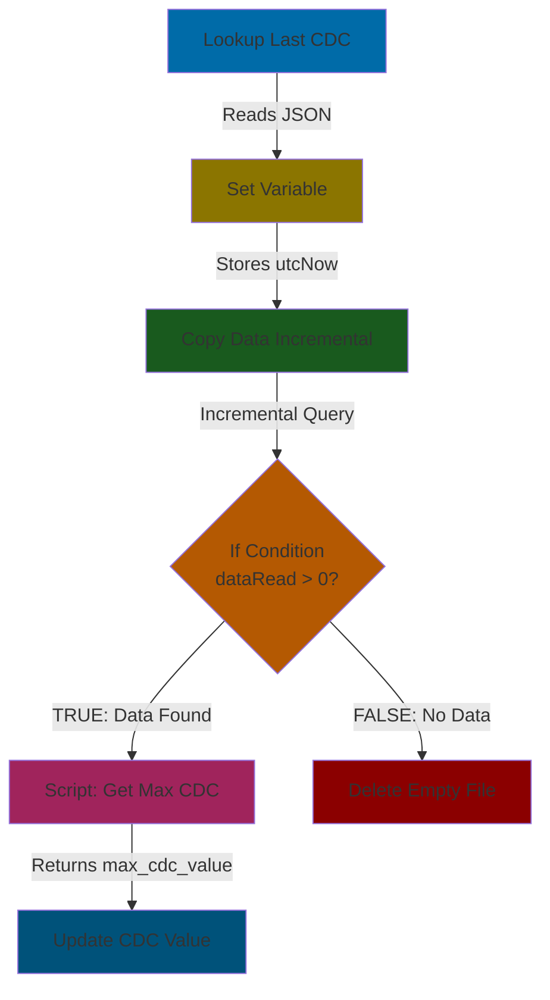
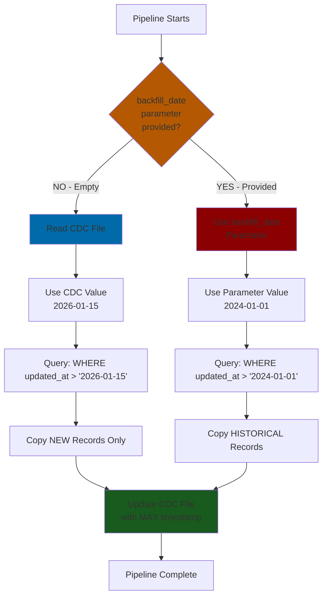
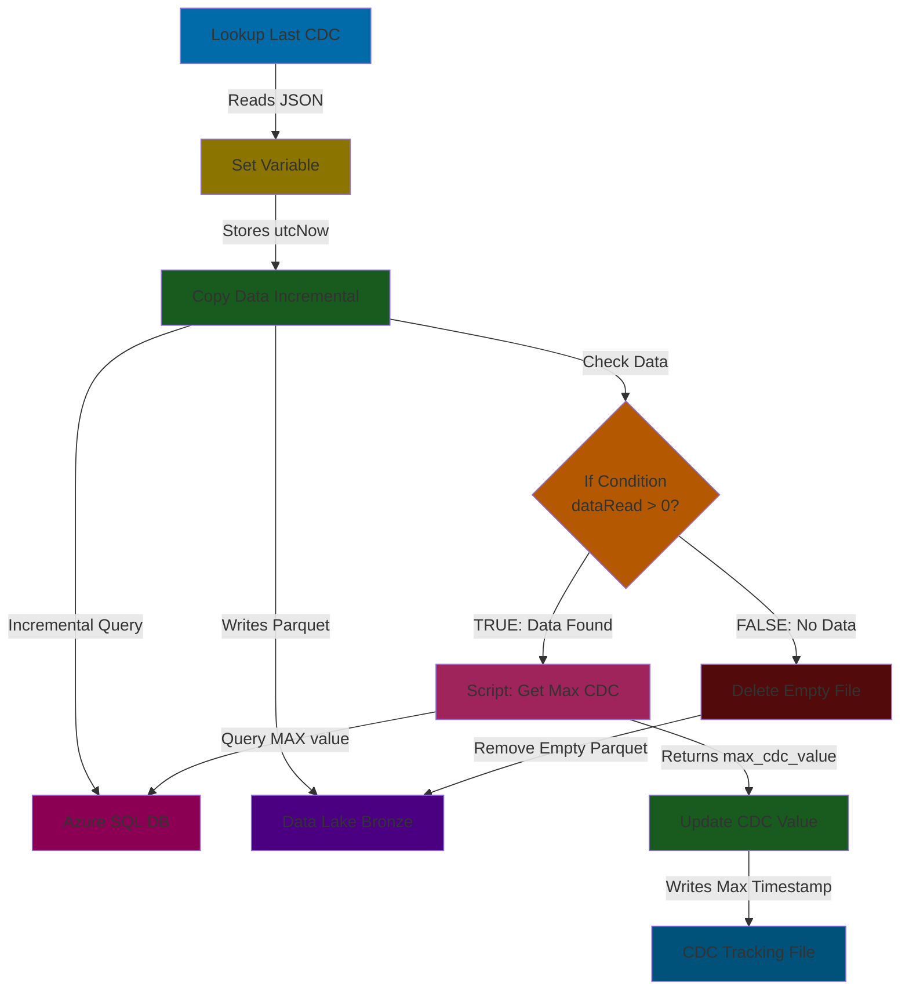
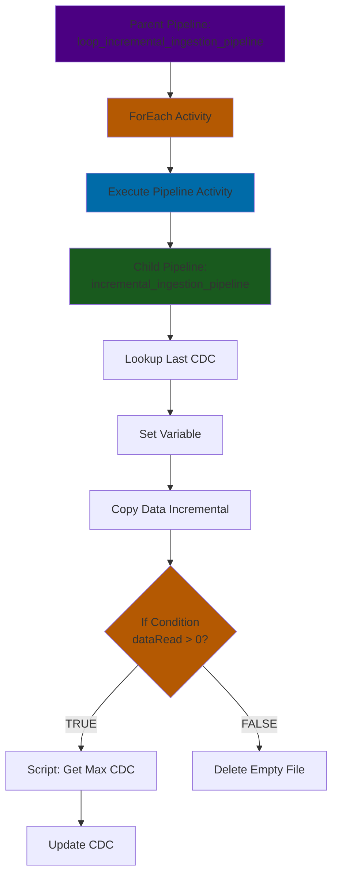
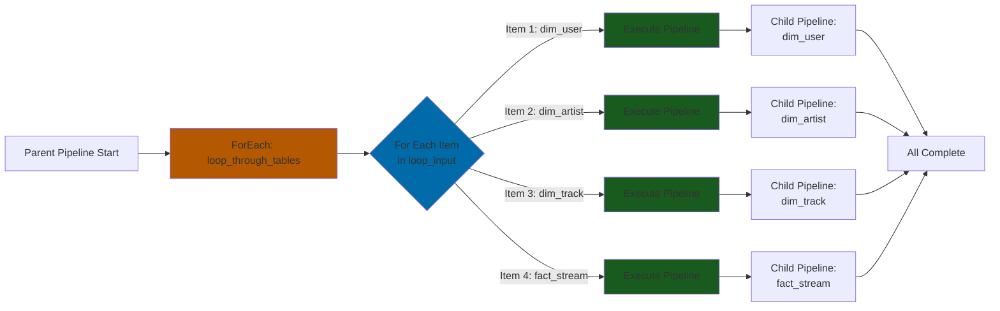
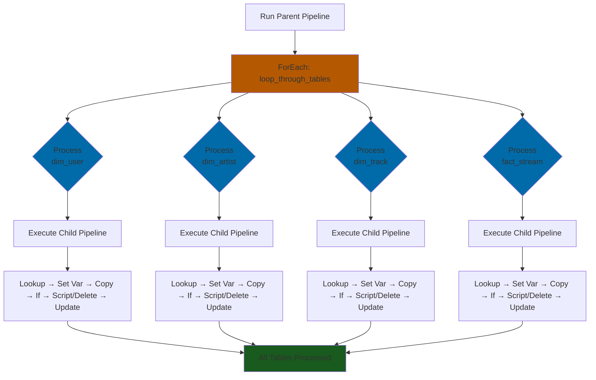
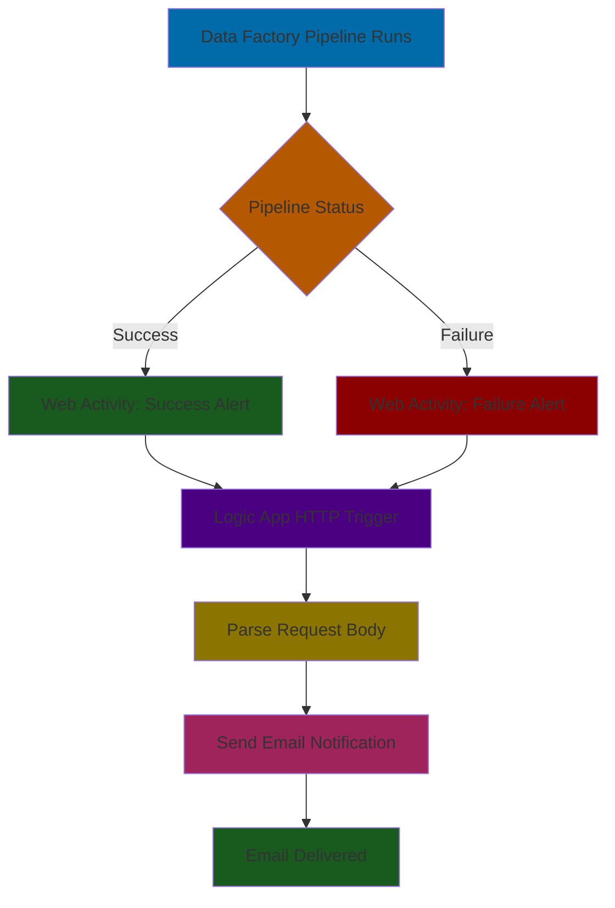
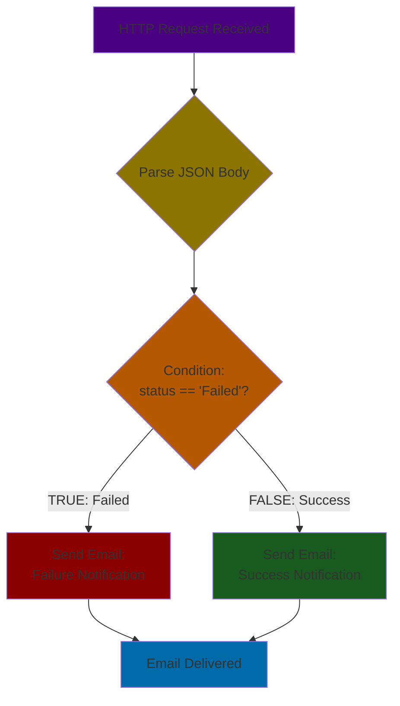
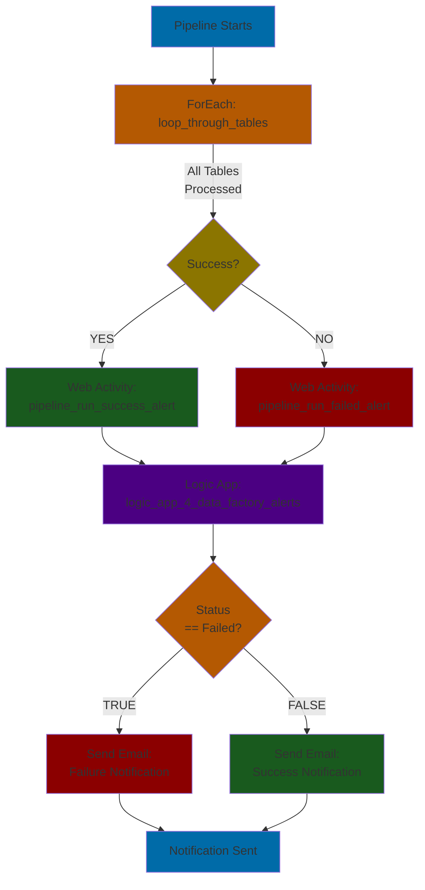

# Azure Data Engineering Project - Setup Guide

> Step-by-step guide to set up Azure resources for a data engineering project.

> 
---

## Prerequisites

- Azure CLI installed (`az --version` to verify)
- Azure account (Free tier or Student subscription works)
- Terminal/Bash shell

---

## Step 0: Load Environment Variables

**IMPORTANT:** Before running any commands, load your environment variables from `.env` file.

### For Bash/Zsh users

```bash
# Load environment variables from .env file
# Run this at the start of EVERY terminal session
set -a  # automatically export all variables
source .env
set +a  # disable auto-export

# Verify variables are loaded
echo "Resource Group: $AZURE_RESOURCE_GROUP"
echo "Storage Account: $AZURE_STORAGE_ACCOUNT_NAME"
echo "SQL Server: $AZURE_SQL_SERVER_NAME"
```

### For Fish shell users

Fish shell doesn't support bash `.env` syntax. Use this helper function:

```bash
# Option 1: One-liner to load .env (run each time)
for line in (cat .env | grep -v '^#' | grep '=')
    set -gx (echo $line | cut -d '=' -f1) (echo $line | cut -d '=' -f2- | tr -d '"')
end

# Verify variables are loaded
echo "Resource Group: $AZURE_RESOURCE_GROUP"
echo "Storage Account: $AZURE_STORAGE_ACCOUNT_NAME"
echo "SQL Server: $AZURE_SQL_SERVER_NAME"
```

```bash
# Option 2: Add this function to ~/.config/fish/config.fish for permanent use
function loadenv
    for line in (cat .env | grep -v '^#' | grep '=')
        set -gx (echo $line | cut -d '=' -f1) (echo $line | cut -d '=' -f2- | tr -d '"')
    end
    echo "Loaded .env variables"
end

# Then just run: loadenv
```

```fish
# Option 3: Use bass plugin (if installed) to run bash commands
# Install: fisher install edc/bass
bass source .env
```

> **Note:** The `-gx` flag in fish means global and exported (available to subprocesses).

---

## Step 1: Login to Azure CLI

```bash
# Login to Azure (opens browser for authentication)
az login
```

**What happens:**

- Opens your default browser
- You authenticate with your Microsoft/Azure account
- CLI stores credentials locally (~/.azure/)

```bash
# Verify you're logged in and see your subscriptions
az account show --output table

# If you have multiple subscriptions, set the one you want to use
# az account set --subscription "Your Subscription Name"
```

---

## Step 2: Create a Resource Group

**What is a Resource Group?**
A logical container that holds related Azure resources. Think of it as a folder for your project.

```bash
# Create Resource Group using environment variables
az group create \
    --name "$AZURE_RESOURCE_GROUP" \
    --location "$AZURE_LOCATION"
```

**Expected output:**

```json
{
  "id": "/subscriptions/.../resourceGroups/azure-4-data-engineering-rg",
  "location": "eastus",
  "name": "azure-4-data-engineering-rg",
  "properties": {
    "provisioningState": "Succeeded"
  }
}
```

```bash
# Verify creation
az group show --name "$AZURE_RESOURCE_GROUP" --output table
```

---

## Step 3: Create a Storage Account

**What is a Storage Account?**
Central storage for all data types - blobs, files, queues, tables. This will be our Data Lake.

```bash
# Create Storage Account with Data Lake Gen2 enabled (--hns true)
az storage account create \
    --name "$AZURE_STORAGE_ACCOUNT_NAME" \
    --resource-group "$AZURE_RESOURCE_GROUP" \
    --location "$AZURE_LOCATION" \
    --sku "Standard_LRS" \
    --kind "StorageV2" \
    --hns true \
    --access-tier "Hot" \
    --allow-blob-public-access false \
    --min-tls-version "TLS1_2"
```

**Flag explanations:**

| Flag | Value | Purpose |
| ------ | ------- | --------- |
| `--sku` | Standard_LRS | Locally redundant storage (cheapest) |
| `--kind` | StorageV2 | General-purpose v2 (recommended) |
| `--hns` | true | Hierarchical namespace = Data Lake Gen2 |
| `--access-tier` | Hot | Frequently accessed data |
| `--allow-blob-public-access` | false | Security: no anonymous access |
| `--min-tls-version` | TLS1_2 | Security: enforce TLS 1.2 |

```bash
# Verify creation
az storage account show \
    --name "$AZURE_STORAGE_ACCOUNT_NAME" \
    --resource-group "$AZURE_RESOURCE_GROUP" \
    --output table
```

### Get Storage Account Key (for later use)

```bash
# Get the storage account key and save to .env
STORAGE_KEY=$(az storage account keys list \
    --account-name "$AZURE_STORAGE_ACCOUNT_NAME" \
    --resource-group "$AZURE_RESOURCE_GROUP" \
    --query "[0].value" -o tsv)

echo "Storage Key: $STORAGE_KEY"
echo "Add this to your .env file as AZURE_STORAGE_ACCOUNT_KEY"
```

for fish shell users:

```bash
set STORAGE_KEY (az storage account keys list \
    --account-name "$AZURE_STORAGE_ACCOUNT_NAME" \
    --resource-group "$AZURE_RESOURCE_GROUP" \
    --query "[0].value" -o tsv)
echo "Storage Key: $STORAGE_KEY"
echo "Add this to your .env file as AZURE_STORAGE_ACCOUNT_KEY"
```

---

## Step 4: Create a Data Factory

**What is Data Factory?**
Azure's ETL/ELT orchestration service. It moves and transforms data between sources.

```bash
# Create Data Factory
az datafactory create \
    --name "$AZURE_DATA_FACTORY_NAME" \
    --resource-group "$AZURE_RESOURCE_GROUP" \
    --location "$AZURE_LOCATION"
```

> **Note:** Data Factory creation takes 1-2 minutes.

```bash
# Verify creation
az datafactory show \
    --name "$AZURE_DATA_FACTORY_NAME" \
    --resource-group "$AZURE_RESOURCE_GROUP" \
    --output table
```

**Access Data Factory Studio:**

```url
https://adf.azure.com/home?factory=/subscriptions/<sub-id>/resourceGroups/<rg>/providers/Microsoft.DataFactory/factories/<adf-name>
```

Or simply search "Data Factory" in Azure Portal and click on your factory.

---

## Step 5: Create Storage Containers (Medallion Architecture)

**Medallion Architecture:**

- `landing` - Raw data arrives here first
- `bronze` - Raw data copy (unchanged from source)
- `silver` - Cleaned and validated data
- `gold` - Business-ready aggregations

```bash
# Create all containers for medallion architecture
for container in landing bronze silver gold; do
    echo "Creating container: $container"
    az storage container create \
        --name "$container" \
        --account-name "$AZURE_STORAGE_ACCOUNT_NAME" \
        --auth-mode login
done
```

> **Note:** If `--auth-mode login` gives permission errors, use `--auth-mode key` instead.
> The key method is simpler for learning but less secure for production.

```bash
# Alternative: Use key authentication (if login mode fails)
az storage container create \
    --name "landing" \
    --account-name "$AZURE_STORAGE_ACCOUNT_NAME" \
    --account-key "$AZURE_STORAGE_ACCOUNT_KEY"
```

```bash
# Verify containers were created
az storage container list \
    --account-name "$AZURE_STORAGE_ACCOUNT_NAME" \
    --auth-mode login \
    --output table
```

It should list:

```bash
Name     Lease Status    Last Modified
-------  --------------  -------------------------
bronze                   2026-02-01T05:03:01+00:00
gold                     2026-02-01T05:06:47+00:00
landing                  2026-02-01T05:06:56+00:00
silver                   2026-02-01T05:05:37+00:00
```

---

## Step 6: Upload Sample Data

```bash
# Upload sample data to the landing container
az storage blob upload \
    --account-name "$AZURE_STORAGE_ACCOUNT_NAME" \
    --container-name "landing" \
    --name "data/customers.csv" \
    --file "data/customers.csv" \
    --auth-mode key \
    --overwrite
```

> **Note:** `--overwrite` allows re-uploading without errors (like S3 behavior).

```bash
# Verify upload
az storage blob list \
    --account-name "$AZURE_STORAGE_ACCOUNT_NAME" \
    --container-name "landing" \
    --auth-mode key \
    --output table
```

### Upload Multiple Files

```bash
# Upload all CSV files from data directory
az storage blob upload-batch \
    --account-name "$AZURE_STORAGE_ACCOUNT_NAME" \
    --destination "landing" \
    --source "./data" \
    --pattern "*.csv" \
    --auth-mode key \
    --overwrite
```

---

## Step 7: Create Azure SQL Database

**Architecture:**

```architecture
SQL Server (logical server) -> contains -> SQL Database
          ↓
    Firewall Rules (who can connect)
```

### 7.1 Create SQL Server

```bash
# Create SQL Server (logical server)
# Using environment variables for credentials (secure!)
az sql server create \
    --name "$AZURE_SQL_SERVER_NAME" \
    --resource-group "$AZURE_RESOURCE_GROUP" \
    --location "$AZURE_LOCATION_SQL" \
    --admin-user "$AZURE_SQL_DATABASE_USER" \
    --admin-password "$AZURE_SQL_DATABASE_PASSWORD"
```

> **Note:** We use `westus2` for SQL because Student subscriptions have region limitations.
> The server name becomes: `sql-server-4-data-engineering.database.windows.net`

```bash
# Verify SQL Server creation
az sql server show \
    --name "$AZURE_SQL_SERVER_NAME" \
    --resource-group "$AZURE_RESOURCE_GROUP" \
    --output table
```

### 7.2 Create SQL Database

```bash
# Create SQL Database (Basic tier = $5/month, good for learning)
az sql db create \
    --name "$AZURE_SQL_DATABASE_NAME" \
    --server "$AZURE_SQL_SERVER_NAME" \
    --resource-group "$AZURE_RESOURCE_GROUP" \
    --edition "Basic" \
    --capacity 5
```

**Pricing tiers:**

| Tier | DTU | Storage | Cost/Month | Use Case |
| ------ | ----- | --------- | ------------ | ---------- |
| Basic | 5 | 2 GB | ~$5 | Learning, dev |
| Standard S0 | 10 | 250 GB | ~$15 | Small apps |
| Standard S1 | 20 | 250 GB | ~$30 | Production |

```bash
# Verify database creation
az sql db show \
    --name "$AZURE_SQL_DATABASE_NAME" \
    --server "$AZURE_SQL_SERVER_NAME" \
    --resource-group "$AZURE_RESOURCE_GROUP" \
    --output table
```

### 7.3 Configure Firewall Rules

**IMPORTANT:** By default, SQL Server blocks ALL connections. You must configure firewall rules.

```bash
# Rule 1: Allow Azure services (required for Data Factory, Databricks, etc.)
az sql server firewall-rule create \
    --name "AllowAzureServices" \
    --server "$AZURE_SQL_SERVER_NAME" \
    --resource-group "$AZURE_RESOURCE_GROUP" \
    --start-ip-address 0.0.0.0 \
    --end-ip-address 0.0.0.0
```

> **Note:** `0.0.0.0` to `0.0.0.0` is a special range that means "Allow Azure services"

```bash
# Rule 2: Allow your current IP address (for local development)
MY_IP=$(curl -s ifconfig.me)
echo "Your IP: $MY_IP"

az sql server firewall-rule create \
    --name "AllowMyIP" \
    --server "$AZURE_SQL_SERVER_NAME" \
    --resource-group "$AZURE_RESOURCE_GROUP" \
    --start-ip-address "$MY_IP" \
    --end-ip-address "$MY_IP"
```

```bash
# Verify firewall rules
az sql server firewall-rule list \
    --server "$AZURE_SQL_SERVER_NAME" \
    --resource-group "$AZURE_RESOURCE_GROUP" \
    --output table
```

### 7.4 Test SQL Connection

```bash
# Test connection using sqlcmd (if installed)
# sqlcmd -S "$AZURE_SQL_SERVER_NAME.database.windows.net" \
#        -d "$AZURE_SQL_DATABASE_NAME" \
#        -U "$AZURE_SQL_DATABASE_USER" \
#        -P "$AZURE_SQL_DATABASE_PASSWORD"

# Or use Azure Portal -> SQL Database -> Query Editor
echo "Connection string for your apps:"
echo "$AZURE_SQL_CONNECTION_STRING"
```

---

## Step 8: Adding Data to Azure SQL Database

You can run SQL scripts against your Azure SQL Database using several methods:

### Option 1: VS Code with MS SQL Extension (Recommended)

1. **Install the extension**: Search for "SQL Server (mssql)" in VS Code extensions

2. **Connect to your database**:
   - Open Command Palette: `Cmd + Shift + P` (Mac) or `Ctrl + Shift + P` (Windows)
   - Type: `MS SQL: Connect`
   - Enter connection details:

     ```text
     Server:   sql-server-4-data-engineering.database.windows.net
     Database: sqldb-4-data-engineering
     Auth:     SQL Login
     User:     (from your .env file)
     Password: (from your .env file)
     ```

   - Save the connection profile when prompted (e.g., "AzureSpotifyDB")

3. **Run your SQL script**:
   - Open `sql/spotify_initial_load.sql`
   - `Cmd + Shift + P` -> `MS SQL: Execute Query`
   - Select your saved connection
   - **Quick tip**: Right-click in the SQL file and select "Execute Query"

### Option 2: Azure Portal Query Editor

```text
Azure Portal -> SQL Database -> Query Editor -> Login -> Paste & Run
```

### Option 3: sqlcmd CLI

```bash
# Install sqlcmd (Mac)
brew install sqlcmd

# Run a SQL script
sqlcmd -S "$AZURE_SQL_SERVER_NAME.database.windows.net" \
       -d "$AZURE_SQL_DATABASE_NAME" \
       -U "$AZURE_SQL_DATABASE_USER" \
       -P "$AZURE_SQL_DATABASE_PASSWORD" \
       -i sql/spotify_initial_load.sql
```

### Option 4: Azure Data Studio

```bash
# Install on Mac
brew install --cask azure-data-studio
```

Then connect using the same credentials as Option 1.

---

## Step 9: Create Linked Services in Data Factory

Linked services are connection strings that allow Data Factory to connect to external data sources.

### 9.1 Create a Linked Service to Azure SQL Database

**Via Data Factory Studio (UI):**

1. **Open Data Factory Studio**:
   - Go to Azure Portal -> Data Factory -> Click "Launch Studio"

2. **Navigate to Linked Services**:
   - Click the "Manage" tab (gear icon on the left sidebar)
   - Select "Linked services" under "Connections"
   - Click "+ New"

3. **Select Azure SQL Database**:
   - Search for "Azure SQL Database"
   - Click "Continue"

4. **Configure the connection**:
   - **Name**: `AzureSqlDb_LinkedService`
   - **Server name**: `sql-server-4-data-engineering.database.windows.net`
   - **Database name**: `sqldb-4-data-engineering`
   - **Authentication type**: SQL authentication
   - **User name**: (from your .env file)
   - **Password**: (from your .env file)
   - Click "Test connection" to verify
   - Click "Create"

**Via Azure CLI:**

```bash
# Create a JSON definition file for the linked service
cat > /tmp/sql-linked-service.json << 'EOF'
{
    "type": "AzureSqlDatabase",
    "typeProperties": {
        "connectionString": "Server=tcp:sql-server-4-data-engineering.database.windows.net,1433;Database=sqldb-4-data-engineering;User ID=real_mfalme;Password=YOUR_PASSWORD;Encrypt=True;Connection Timeout=30"
    }
}
EOF

# Create the linked service
az datafactory linked-service create \
    --factory-name "$AZURE_DATA_FACTORY_NAME" \
    --resource-group "$AZURE_RESOURCE_GROUP" \
    --name "AzureSqlDb_LinkedService" \
    --properties @/tmp/sql-linked-service.json
```

> **Note:** Replace `YOUR_PASSWORD` with your actual password or use Key Vault for production.

### 9.2 Create a Linked Service to Azure Data Lake Storage Gen2

**Via Data Factory Studio (UI):**

1. **Navigate to Linked Services**:
   - Click the "Manage" tab -> "Linked services" -> "+ New"

2. **Select Azure Data Lake Storage Gen2**:
   - Search for "Azure Data Lake Storage Gen2"
   - Click "Continue"

3. **Configure the connection**:
   - **Name**: `AzureDataLake_LinkedService`
   - **Authentication method**: Account key
   - **Account selection method**: From Azure subscription
   - **Storage account name**: `sa4dataengineering4rk`
   - Click "Test connection" to verify
   - Click "Create"

**Via Azure CLI:**

```bash
# Create a JSON definition file for the storage linked service
cat > /tmp/storage-linked-service.json << 'EOF'
{
    "type": "AzureBlobFS",
    "typeProperties": {
        "url": "https://sa4dataengineering4rk.dfs.core.windows.net",
        "accountKey": {
            "type": "SecureString",
            "value": "YOUR_STORAGE_ACCOUNT_KEY"
        }
    }
}
EOF

# Create the linked service
az datafactory linked-service create \
    --factory-name "$AZURE_DATA_FACTORY_NAME" \
    --resource-group "$AZURE_RESOURCE_GROUP" \
    --name "AzureDataLake_LinkedService" \
    --properties @/tmp/storage-linked-service.json
```

> **Note:** Replace `YOUR_STORAGE_ACCOUNT_KEY` with your actual key from `.env` or use Managed Identity for production.

### Verify Linked Services

```bash
# List all linked services in your Data Factory
az datafactory linked-service list \
    --factory-name "$AZURE_DATA_FACTORY_NAME" \
    --resource-group "$AZURE_RESOURCE_GROUP" \
    --output table
```

## Step 10: Create Incremental Ingestion Pipeline (Change Data Capture)

### Overview

This pipeline implements **Change Data Capture (CDC)** to incrementally load only new or modified records from Azure SQL Database to Azure Data Lake Storage. Instead of loading the entire table each time, we track the last processed timestamp and only load records created/modified after that time.

**Pipeline Flow:**

```pipeline_flow
┌────────────┐   ┌────────────┐   ┌────────────┐   ┌────────────┐   ┌────────────┐
│  Lookup    │──>│Set Variable│──>│ Copy Data  │──>│   Script   │──>│ Copy Data  │
│Last CDC    │   │(curr_time) │   │(Increment) │   │(Get Max)   │   │(Update CDC)│
└────────────┘   └────────────┘   └────────────┘   └────────────┘   └────────────┘
      │                │                 │                 │                 │
      │ Read from:     │ Captures:       │ Write to:       │ Query:          │ Update:
      │ bronze/        │ utcNow()        │ bronze/         │ SELECT MAX      │ bronze/
      │ change_data    │                 │ dim_user/       │ (updated_at)    │ change_data
      │ _capture/      │                 │ dim_user_       │ FROM table      │ _capture/
      │ change_data    │                 │ 2026-02...      │                 │ change_data
      │ _capture.json  │                 │                 │ Returns:        │ _capture.json
      │                │                 │ SQL Query:      │ max_cdc_value   │
      │ Contains:      │                 │ WHERE           │                 │ Uses:
      │ {"cdc_value":  │                 │ updated_at >    │                 │ max_cdc_value
      │  "2026-01-01"} │                 │ '2026-01-01'    │                 │
```

**How it works:**

1. **Lookup** reads the last processed timestamp from a JSON file
2. **Set Variable** captures the current timestamp for file naming
3. **Copy Data (Incremental)** queries SQL database for records newer than last timestamp
4. **Script** queries the maximum CDC value from the source table (actual max timestamp from data)
5. **Copy Data (Update CDC)** writes the max CDC value to the tracking file automatically

---

### Step 10.1: Prepare the CDC Tracking File

First, create a JSON file to track the last CDC timestamp.

inside `change_data_capture` add a file named `change_data_capture.json` with the following content:

```json
{
    "cdc_value": "1900-01-01"
}
```

```bash
# Upload to Azure (directory will be created automatically with the file path)
az storage blob upload \
    --account-name "$AZURE_STORAGE_ACCOUNT_NAME" \
    --container-name "bronze" \
    --name "change_data_capture/change_data_capture.json" \
    --file change_data_capture/change_data_capture.json \
    --auth-mode key \
    --overwrite
```

> **Note:**
>
> - `"1900-01-01"` ensures the first run captures all historical data
> - The `change_data_capture/` directory is created automatically when uploading the file
> - Azure Data Lake Gen2 (hierarchical namespace) creates directories implicitly
> - Also create `change_data_capture/empty.json` with `{}` - this will be updated with new CDC values by the pipeline

---

### Step 10.2: Create Pipeline Parameters

1. **Open Data Factory Studio** -> **Author** tab -> **Pipelines** -> **+ New Pipeline**
2. **Name**: `incremental_ingestion_pipeline`
3. **Add Pipeline Parameters** (click on canvas background to see properties):

| Parameter Name | Type | Default Value | Description |
| ---------------- | ------ | --------------- | ------------- |
| `schema` | String | `dbo` | SQL schema name |
| `table` | String | `dim_user` | SQL table name |
| `change_data_capture_column` | String | `updated_at` | Column to track changes |

**How to add parameters:**

- Click on empty canvas (not an activity)
- Click **Parameters** tab in the bottom panel
- Click **+ New** for each parameter above

---

### Step 10.3: Create Pipeline Variable

Variables store temporary values during pipeline execution.

1. **Click on canvas background** -> **Variables** tab
2. **Add Variable**:
   - **Name**: `current_cdc_value`
   - **Type**: String
   - **Default value**: (leave empty)

---

### Step 10.4: Add Lookup Activity

The Lookup activity reads the last CDC timestamp from the JSON file.

#### A. Add the Activity

1. In the **Activities** toolbar, expand **General**
2. Drag **Lookup** onto the canvas
3. **Name**: `look_up_last_cdc_value`

#### B. Create JSON Dataset (Dynamic)

1. In the **Settings** tab of Lookup activity -> **Source dataset** -> **+ New**
2. Select **Azure Data Lake Storage Gen2** -> **Continue**
3. Select format: **JSON** -> **Continue**
4. Configure dataset:
   - **Name**: `azure_data_lake_storage_json_dynamic`
   - **Linked service**: `azure_data_lake_4_data_engineering`
   - Click **OK**

5. **Open the dataset for parameterization**:
   - Click the link: `Open this dataset for more advanced configuration with parameterization`
   - Go to **Parameters** tab
   - Add three parameters:

   | Parameter | Type | Default Value |
   | ----------- | ------ | --------------- |
   | `container` | String | (empty) |
   | `folder` | String | (empty) |
   | `file` | String | (empty) |

6. **Configure File Path** (in **Connection** tab):
   - Click in the **File path** boxes and use **Add dynamic content**:

   ```file_path
   Container: @dataset().container
   Directory: @dataset().folder  
   File:      @dataset().file
   ```

7. **Save** and go back to the pipeline

#### C. Configure Lookup Activity Parameters

Back in the Lookup activity's **Settings** tab:

- **Source dataset**: `azure_data_lake_storage_json_dynamic`
- **Dataset parameters**:
  - `container`: `bronze`
  - `folder`: `change_data_capture`
  - `file`: `change_data_capture.json`
- **First row only**: - (checked)

---

### Step 10.5: Add Set Variable Activity

This captures the current timestamp for naming the output file.

1. Drag **Set Variable** activity onto canvas
2. **Name**: `set_current_cdc_value`
3. Connect **Lookup** -> **Set Variable** (drag the green arrow)
4. In **Settings** tab:
   - **Variable name**: `current_cdc_value`
   - **Value**: Click **Add dynamic content** and enter:

   ```time
   @utcNow()
   ```

---

### Step 10.6: Add Copy Data Activity

This reads incremental data from SQL and writes to Data Lake.

#### A. Add the Activity - Copy Data

1. Drag **Copy Data** activity onto canvas
2. **Name**: `azure_sql_to_lake`
3. Connect **Set Variable** -> **Copy Data** (drag the green arrow)

> **IMPORTANT**: The order must be: Lookup -> Set Variable -> Copy Data

#### B. Configure Source (SQL Database)

1. **Source** tab -> **Source dataset** -> **+ New**
2. Select **Azure SQL Database** -> **Continue**
3. Configure dataset:
   - **Name**: `azure_sql_data_source_pipeline`
   - **Linked service**: `azure_db_4_data_engineering`
   - Click **OK**

4. **Back in Source tab**:
   - **Use query**: **Query**
   - **Query**: Click **Add dynamic content** and enter:

   ```sql
   SELECT * 
   FROM @{pipeline().parameters.schema}.@{pipeline().parameters.table} 
   WHERE @{pipeline().parameters.change_data_capture_column} > '@{activity('look_up_last_cdc_value').output.firstRow.cdc_value}'
   ```

   > **Explanation**:
   > - `@{pipeline().parameters.schema}` -> `dbo`
   > - `@{pipeline().parameters.table}` -> `dim_user`
   > - `@{pipeline().parameters.change_data_capture_column}` -> `updated_at`
   > - `@{activity('look_up_last_cdc_value').output.firstRow.cdc_value}` -> Value from JSON file

#### C. Create Parquet Dataset (Dynamic)

1. **Sink** tab -> **Sink dataset** -> **+ New**
2. Select **Azure Data Lake Storage Gen2** -> **Continue**
3. Select format: **Parquet** -> **Continue**
4. Configure dataset:
   - **Name**: `azure_data_lake_storage_parquet_dynamic`
   - **Linked service**: `azure_data_lake_4_data_engineering`
   - Click **OK**

5. **Open the dataset for parameterization**:
   - Go to **Parameters** tab
   - Add three parameters:

   | Parameter | Type | Default Value |
   | ----------- | ------ | --------------- |
   | `container` | String | (empty) |
   | `folder` | String | (empty) |
   | `file` | String | (empty) |

6. **Configure File Path** (in **Connection** tab):

   ```file_path
   Container: @dataset().container
   Directory: @dataset().folder
   File:      @concat(dataset().file, '.parquet')
   ```

7. **Save** and go back to the pipeline

#### D. Configure Sink Parameters

Back in the Copy Data **Sink** tab:

- **Sink dataset**: `azure_data_lake_storage_parquet_dynamic`
- **Dataset parameters**:
  - `container`: `bronze`
  - `folder`: `dim_user`
  - `file`: Click **Add dynamic content**:
  
  ```file_path
  @concat(pipeline().parameters.table, '_', variables('current_cdc_value'))
  ```

  This creates files like: `dim_user_2026-02-01T14:30:00Z.parquet`

---

### Step 10.7: Add Script Activity to Get Max CDC Value

This activity queries the actual maximum CDC timestamp from the source table, ensuring accurate tracking.

#### A. Add the Activity - Script

1. Drag **Script** activity onto canvas (from **General** section)
2. **Name**: `script_get_max_cdc`
3. Connect **azure_sql_to_lake** -> **script_get_max_cdc** (drag the green arrow)

#### B. Configure Linked Service

1. **Settings** tab -> **Linked service** -> Select `azure_db_4_data_engineering`

#### C. Configure Script Query

1. **Script** field -> Click **Add dynamic content** and enter:

   ```sql
   SELECT MAX(@{pipeline().parameters.change_data_capture_column}) AS max_cdc_value 
   FROM @{pipeline().parameters.schema}.@{pipeline().parameters.table}
   ```

   This query returns the maximum timestamp value from the CDC column in the table that was just processed.

> **Why use MAX() instead of utcNow()?**
>
> - MAX() gets the actual latest timestamp from the data that was copied
> - utcNow() could miss records if there's a delay between data updates and pipeline execution
> - MAX() ensures we capture exactly what was processed, no more, no less

---

### Step 10.8: Add Copy Data Activity to Update CDC Value

This activity automatically updates the CDC tracking file with the max CDC value after data ingestion completes.

#### A. Add the Activity - Copy Data (Update CDC)

1. Drag **Copy Data** activity onto canvas
2. **Name**: `update_last_cdc`
3. Connect **script_get_max_cdc** -> **update_last_cdc** (drag the green arrow)

> **IMPORTANT**: Activity order: Lookup -> Set Variable -> Copy Data (Incremental) -> Script -> Copy Data (Update CDC)

#### B. Configure Source (Empty Dataset)

1. **Source** tab -> **Source dataset** -> Select `azure_data_lake_storage_json_dynamic`
2. **Dataset parameters**:
   - `container`: `bronze`
   - `folder`: `change_data_capture`
   - `file`: `empty.json`

**Critical: Prepare the empty.json file first:**

```bash
# Create empty.json locally with proper structure
echo '[{"placeholder":""}]' > change_data_capture/empty.json

# Upload to Azure
az storage blob upload \
    --account-name "$AZURE_STORAGE_ACCOUNT_NAME" \
    --container-name "bronze" \
    --name "change_data_capture/empty.json" \
    --file change_data_capture/empty.json \
    --auth-mode key \
    --overwrite
```

> **Why this structure?** Copy Data needs at least one row to process. The array `[{"placeholder":""}]` provides that row, and the Additional column will be added to it.

#### C. Configure Sink (CDC Tracking File)

1. **Sink** tab -> **Sink dataset** -> Select `azure_data_lake_storage_json_dynamic`
2. **Dataset parameters**:
   - `container`: `bronze`
   - `folder`: `change_data_capture`
   - `file`: `change_data_capture.json`

**CRITICAL - Configure Sink Settings:**

1. In the **Sink** tab, click the **Settings** icon (gear/wrench next to the dataset dropdown)
2. Configure these settings:
   - **File pattern**: Select **Set of objects** (NOT "Array of objects")
   - **Max rows per file**: Leave empty
   - Click **OK**

> **This is the key setting!** "Set of objects" creates `{"cdc_value": "..."}` instead of `[{"cdc_value": "..."}]`

#### D. Add Additional Column with Max CDC Value

1. In the **Source** tab, scroll down to **Additional columns**
2. Click **+ New**
3. Configure:
   - **Name**: `cdc_value`
   - **Value**: Click **Add dynamic content** and enter:

```script
@activity('script_get_max_cdc').output.resultSets[0].rows[0].max_cdc_value
```

**Important Notes:**

- Do NOT add any other columns
- Make sure the name is exactly `cdc_value` (lowercase, with underscore)
- The expression must reference the Script activity output correctly

#### E. Verify Configuration Checklist

Before running, verify:

- `bronze/change_data_capture/empty.json` exists with content: `[{"placeholder":""}]`
- Sink **File pattern** is set to **Set of objects**
- Additional column name is `cdc_value`
- Additional column value uses the Script activity output
- Activity dependency: Script -> Copy Data (Update CDC)

This configuration should create a clean JSON file: `{"cdc_value": "2026-02-01T12:45:30Z"}`

---

#### Alternative: Use Web Activity (If Copy Data still doesn't work)

1. Drag **Web** activity onto canvas (from **General** section)
2. **Name**: `update_last_cdc`
3. Connect **script_get_max_cdc** -> **update_last_cdc** (drag the green arrow)

**Configure Web Activity:**

1. **Settings** tab:
   - **URL**: Click **Add dynamic content** and enter:

```script
@concat('https://', 'sa4dataengineering4rk', '.blob.core.windows.net/bronze/change_data_capture/change_data_capture.json')
```

- **Method**: `PUT`

- **Headers**: Click **+ New** and add:
  - Name: `x-ms-blob-type`
  - Value: `BlockBlob`

- **Body**: Click **Add dynamic content** and enter:

   ```json
   @concat('{"cdc_value": "', activity('script_get_max_cdc').output.resultSets[0].rows[0].max_cdc_value, '"}')
   ```

- **Authentication**: Select **MSI** (Managed Service Identity)
- **Resource**: `https://storage.azure.com/`

1. **Grant Data Factory permissions**:

   ```bash
   # Get Data Factory managed identity principal ID
   ADF_PRINCIPAL_ID=$(az datafactory show \
       --name "$AZURE_DATA_FACTORY_NAME" \
       --resource-group "$AZURE_RESOURCE_GROUP" \
       --query "identity.principalId" -o tsv)
   
   # Assign Storage Blob Data Contributor role
   az role assignment create \
       --assignee "$ADF_PRINCIPAL_ID" \
       --role "Storage Blob Data Contributor" \
       --scope "/subscriptions/$(az account show --query id -o tsv)/resourceGroups/$AZURE_RESOURCE_GROUP/providers/Microsoft.Storage/storageAccounts/$AZURE_STORAGE_ACCOUNT_NAME"
   ```

#### Original Copy Data Approach (If you prefer to fix it)

If you want to keep using Copy Data, here's how to fix the issue:

#### A. Add the Activity - Copy Data (Update Last CDC)

1. Drag **Copy Data** activity onto canvas
2. **Name**: `update_last_cdc`
3. Connect **azure_sql_to_lake** -> **update_last_cdc** (drag the green arrow)

> **IMPORTANT**: Activity order: Lookup -> Set Variable -> Copy Data (Incremental) -> Script -> Copy Data (Update CDC)

#### B. Configure Source (Empty Dataset) - JSON

Since we're creating new content (not copying from a source), we'll use a simple JSON dataset:

1. **Source** tab -> **Source dataset** -> Select `azure_data_lake_storage_json_dynamic`
2. **Dataset parameters**:
   - `container`: `bronze`
   - `folder`: `change_data_capture`
   - `file`: `empty.json`

> **Note**: The `empty.json` file should contain just `{}` and serves as a placeholder source.

#### C. Configure Sink (CDC Tracking File) - JSON

1. **Sink** tab -> **Sink dataset** -> Select `azure_data_lake_storage_json_dynamic`
2. **Dataset parameters**:
   - `container`: `bronze`
   - `folder`: `change_data_capture`
   - `file`: `change_data_capture.json`

#### D. Add Additional Column with Max CDC Value - JSON

This is the key step - we add a column with the max CDC value from the Script activity:

1. In the **Source** tab, scroll down to **Additional columns**
2. Click **+ New**
3. Configure:
   - **Name**: `cdc_value`
   - **Value**: Click **Add dynamic content** and enter:

```script
@activity('script_get_max_cdc').output.resultSets[0].rows[0].max_cdc_value
```

This writes the actual maximum timestamp from the processed data to the JSON file, ensuring accurate CDC tracking for the next pipeline run.

---

### Step 10.9: Handle Empty Incremental Loads

**Problem:** When no new records exist in the source table (where the CDC column is greater than the last recorded value), the Copy Data activity creates an empty Parquet file in the `{table}` folder. We need to:

1. Check if any data was actually copied
2. Skip CDC update activities if no data was found
3. Delete the empty file to keep the data lake clean

**Solution:** Add an If Condition activity to check the output of the Copy Data activity.

#### A. Add If Condition Activity

1. Drag **If Condition** activity onto canvas (from **Iteration & conditionals** section)
2. **Name**: `if_new_record_added`
3. Connect **azure_sql_to_lake** -> **if_new_record_added** (drag the green arrow)
4. **Remove** the existing connection from **azure_sql_to_lake** to **script_get_max_cdc**

#### B. Configure the Condition Expression

1. Click on the **if_new_record_added** activity
2. Go to **Activities** tab
3. In **Expression**, click **Add dynamic content** and enter:

```expression
@greater(activity('azure_sql_to_lake').output.dataRead, 0)
```

> **Explanation:** This checks if the `dataRead` property (bytes of data copied) is greater than 0. If true, data was copied; if false, no data was found.

#### C. Configure True Branch (Data Was Copied)

When the condition is **True** (new records found), we proceed with the CDC update:

1. Click on **if_new_record_added** activity
2. Go to **Activities** tab
3. Under **True case**, click the **pencil icon** (✏️) to edit
4. This opens a new canvas for the True branch

**Add activities to True branch:**

1. Drag **script_get_max_cdc** activity into the True branch canvas
2. Drag **update_last_cdc** activity into the True branch canvas
3. Connect **script_get_max_cdc** -> **update_last_cdc**

> **Note:** You may need to recreate these activities if they were already connected differently. The True branch should contain the complete CDC update flow.

#### D. Configure False Branch (No Data Found)

When the condition is **False** (no new records), we delete the empty file:

1. Click on **if_new_record_added** activity
2. Go to **Activities** tab
3. Under **False case**, click the **pencil icon** (✏️) to edit
4. This opens a new canvas for the False branch

**Add Delete activity:**

1. Drag **Delete** activity onto the False branch canvas (from **General** section)
2. **Name**: `delete_empty_file`

**Configure Delete activity:**

1. Click on **delete_empty_file** activity
2. Go to **Settings** tab
3. **Dataset**: Select `azure_data_lake_storage_parquet_dynamic`
4. **Dataset properties**:
   - **container**: `bronze`
   - **folder**: Click **Add dynamic content**:

     ```expression
     @pipeline().parameters.table
     ```

   - **file**: Click **Add dynamic content**:

     ```expression
     @concat(pipeline().parameters.table, '_', variables('current_cdc_value'))
     ```

5. **Logging settings**:
   - **Enable logging**: Unchecked (optional)

> **Explanation:** This deletes the empty Parquet file that was created when no new data was found, keeping the data lake clean.

#### E. Updated Pipeline Flow



**New behavior:**

- If new records found -> Update CDC tracking file with max value
- If no new records -> Delete empty file, keep CDC value unchanged
- CDC tracking file only updates when data is actually processed

---

### Step 10.10: Fix CDC Tracking - Separate Files Per Table

**Problem Identified:**

Currently, we're using a single CDC tracking file (`change_data_capture.json`) for all tables. This creates a critical issue:

- Pipeline runs for `dim_user` -> Updates `cdc_value` to `2026-02-01T10:00:00Z`
- Pipeline runs for `dim_product` -> Reads `2026-02-01T10:00:00Z` (incorrect!)
- Result: `dim_product` skips all records before this timestamp, losing data

**Root Cause:** All tables share the same CDC tracking file, so each table's CDC value overwrites the previous one.

**Solution:** Create separate CDC tracking files for each table using dynamic file names based on the table parameter.

---

#### A. Modify Lookup Activity for Table-Specific CDC Files

Update the Lookup activity to read from table-specific CDC files.

1. **Open the pipeline** -> Click on **look_up_last_cdc_value** activity
2. **Go to Settings tab**
3. **Modify the file parameter**:
   - Current value: `change_data_capture.json`
   - New value: Click **Add dynamic content** and enter:

   ```expression
   @concat(pipeline().parameters.table, '_cdc.json')
   ```

**Result:**

- For `dim_user`: Reads from `dim_user_cdc.json`
- For `dim_artist`: Reads from `dim_artist_cdc.json`
- For `dim_track`: Reads from `dim_track_cdc.json`
- For `dim_date`: Reads from `dim_date_cdc.json`
- For `fact_stream`: Reads from `fact_stream_cdc.json`

---

#### B. Modify Update CDC Activity for Table-Specific Files

Update the Copy Data activity that writes CDC values to use table-specific file names.

1. **Navigate to True branch** of `if_new_record_added` activity
2. **Click on update_last_cdc** Copy Data activity
3. **Go to Sink tab** -> **Dataset properties**
4. **Modify the file parameter**:
   - Current value: `change_data_capture.json`
   - New value: Click **Add dynamic content** and enter:

   ```expression
   @concat(pipeline().parameters.table, '_cdc.json')
   ```

**Result:** Each table writes its CDC value to its own dedicated tracking file.

---

#### C. Create Initial CDC Tracking Files for Each Table

Create separate CDC tracking files for each table you plan to ingest.

**For dim_user table:**

```bash
# Create local file
echo '{"cdc_value": "1900-01-01"}' > change_data_capture/dim_user_cdc.json

# Upload to Azure
az storage blob upload \
    --account-name "$AZURE_STORAGE_ACCOUNT_NAME" \
    --container-name "bronze" \
    --name "change_data_capture/dim_user_cdc.json" \
    --file change_data_capture/dim_user_cdc.json \
    --auth-mode key \
    --overwrite
```

**For dim_track table:**

```bash
# Create local file
echo '{"cdc_value": "1900-01-01"}' > change_data_capture/dim_track_cdc.json

# Upload to Azure
az storage blob upload \
    --account-name "$AZURE_STORAGE_ACCOUNT_NAME" \
    --container-name "bronze" \
    --name "change_data_capture/dim_track_cdc.json" \
    --file change_data_capture/dim_track_cdc.json \
    --auth-mode key \
    --overwrite
```

**For dim_date table:**

```bash
# Create local file
echo '{"cdc_value": "1900-01-01"}' > change_data_capture/dim_date_cdc.json

# Upload to Azure
az storage blob upload \
    --account-name "$AZURE_STORAGE_ACCOUNT_NAME" \
    --container-name "bronze" \
    --name "change_data_capture/dim_date_cdc.json" \
    --file change_data_capture/dim_date_cdc.json \
    --auth-mode key \
    --overwrite
```

**Automated approach for multiple tables:**

```bash
# Fish shell - Create CDC files for all Spotify tables
for table in dim_user dim_artist dim_track dim_date fact_stream
    echo '{"cdc_value": "1900-01-01"}' > change_data_capture/$table"_cdc.json"
    az storage blob upload \
        --account-name "$AZURE_STORAGE_ACCOUNT_NAME" \
        --container-name "bronze" \
        --name "change_data_capture/$table"_cdc.json"" \
        --file change_data_capture/$table"_cdc.json" \
        --auth-mode key \
        --overwrite
    echo "- Created CDC file for $table"
end
```

```bash
# Bash/Zsh - Create CDC files for all Spotify tables
for table in dim_user dim_artist dim_track dim_date fact_stream; do
    echo '{"cdc_value": "1900-01-01"}' > change_data_capture/${table}_cdc.json
    az storage blob upload \
        --account-name "$AZURE_STORAGE_ACCOUNT_NAME" \
        --container-name "bronze" \
        --name "change_data_capture/${table}_cdc.json" \
        --file change_data_capture/${table}_cdc.json \
        --auth-mode key \
        --overwrite
    echo "- Created CDC file for $table"
done
```

> **Note:** These are the actual Spotify database tables with their CDC columns:
>
> - `dim_user` - Spotify users (CDC: `updated_at`)
> - `dim_artist` - Spotify artists (CDC: `updated_at`)
> - `dim_track` - Spotify tracks (CDC: `updated_at`)
> - `dim_date` - Date dimension (**No CDC** - use full load)
> - `fact_stream` - Streaming facts/history (CDC: `stream_timestamp`)
>
> **Important:** `dim_date` is a static reference table and should be loaded fully without CDC.
> `fact_stream` uses `stream_timestamp` instead of `updated_at`.

---

#### D. Verify CDC File Structure in Azure

```bash
# List all CDC tracking files
az storage blob list \
    --account-name "$AZURE_STORAGE_ACCOUNT_NAME" \
    --container-name "bronze" \
    --prefix "change_data_capture/" \
    --auth-mode key \
    --output table
```

**Expected output:**

```output
Name                                      Blob Type    Length
----------------------------------------  -----------  --------
change_data_capture/dim_artist_cdc.json   BlockBlob    29
change_data_capture/dim_date_cdc.json     BlockBlob    29
change_data_capture/dim_track_cdc.json    BlockBlob    29
change_data_capture/dim_user_cdc.json     BlockBlob    29
change_data_capture/empty.json            BlockBlob    20
change_data_capture/fact_stream_cdc.json  BlockBlob    29
```

---

#### E. Test the Pipeline with Different Tables

##### Test Scenario 1: Run for dim_user

1. **Debug the pipeline** with parameters:
   - `schema`: `dbo`
   - `table`: `dim_user`
   - `change_data_capture_column`: `updated_at`

2. **Verify CDC file update:**

   ```bash
   az storage blob download \
       --account-name "$AZURE_STORAGE_ACCOUNT_NAME" \
       --container-name "bronze" \
       --name "change_data_capture/dim_user_cdc.json" \
       --file downloaded_dim_user_cdc.json \
       --auth-mode key
   
   cat downloaded_dim_user_cdc.json
   # Expected: {"cdc_value": "2026-02-03T10:30:45Z"} (actual timestamp from your data)
   ```

##### Test Scenario 2: Run for dim_artist

1. **Debug the pipeline** with parameters:
   - `schema`: `dbo`
   - `table`: `dim_artist`
   - `change_data_capture_column`: `updated_at`

2. **Verify CDC file update:**

   ```bash
   az storage blob download \
       --account-name "$AZURE_STORAGE_ACCOUNT_NAME" \
       --container-name "bronze" \
       --name "change_data_capture/dim_artist_cdc.json" \
       --file downloaded_dim_artist_cdc.json \
       --auth-mode key
   
   cat downloaded_dim_artist_cdc.json
   # Expected: {"cdc_value": "2026-02-03T11:15:22Z"} (different timestamp)
   ```

3. **Verify dim_user CDC file remains unchanged:**

   ```bash
   cat downloaded_dim_user_cdc.json
   # Should still show: {"cdc_value": "2026-02-03T10:30:45Z"}
   ```

**Success Criteria:**

- Each table has its own CDC tracking file
- `dim_user` pipeline updates only `dim_user_cdc.json`
- `dim_artist` pipeline updates only `dim_artist_cdc.json`
- CDC values are independent and don't overwrite each other

---

#### F. Configuration Summary

**Before (Single CDC File):**

```log
Lookup Activity:
  file: change_data_capture.json

Update CDC Activity:
  file: change_data_capture.json

Problem: All tables share one CDC value
```

**After (Table-Specific CDC Files):**

```log
Lookup Activity:
  file: @concat(pipeline().parameters.table, '_cdc.json')
  Examples:
    - dim_user -> dim_user_cdc.json
    - dim_artist -> dim_artist_cdc.json
    - dim_track -> dim_track_cdc.json
    - fact_stream -> fact_stream_cdc.json

Update CDC Activity:
  file: @concat(pipeline().parameters.table, '_cdc.json')
  Examples:
    - dim_user -> dim_user_cdc.json
    - dim_artist -> dim_artist_cdc.json
    - dim_track -> dim_track_cdc.json
    - fact_stream -> fact_stream_cdc.json

Solution: Each table has independent CDC tracking
```

---

#### G. Best Practices

1. **Naming Convention:**
   - Use consistent pattern: `{table_name}_cdc.json`
   - Makes it easy to identify and manage CDC files

2. **Initial Values:**
   - Set to `"1900-01-01"` for historical full load
   - Or set to current date for incremental-only ingestion

3. **Monitoring:**
   - Periodically verify CDC files are updating correctly
   - Check for orphaned CDC files (tables no longer in use)

4. **Reset CDC for a Table:**

   ```bash
   # Reset dim_user to reload all historical data
   echo '{"cdc_value": "1900-01-01"}' > reset_cdc.json
   az storage blob upload \
       --account-name "$AZURE_STORAGE_ACCOUNT_NAME" \
       --container-name "bronze" \
       --name "change_data_capture/dim_user_cdc.json" \
       --file reset_cdc.json \
       --auth-mode key \
       --overwrite
   ```

5. **Cleanup Old Single CDC File:**

   ```bash
   # After verifying table-specific CDC files work, delete the old shared file
   az storage blob delete \
       --account-name "$AZURE_STORAGE_ACCOUNT_NAME" \
       --container-name "bronze" \
       --name "change_data_capture/change_data_capture.json" \
       --auth-mode key
   ```

---

#### H. Advanced: Parameterized Backfilling

**Problem:** What if you need to reload historical data for a specific time period?

**Current Limitation:**

- Manual approach: Edit CDC file directly to reset to an old date
- Example: Change `{"cdc_value": "2026-01-15"}` to `{"cdc_value": "2024-01-01"}`
- Issue: Requires manual Azure portal access, error-prone, no audit trail

**Better Solution:** Add a `backfill_date` parameter to control CDC starting point programmatically.

##### How Backfilling Works

```backfill_flow
Normal Incremental Load:
  CDC file: {"cdc_value": "2026-01-15"}
  Pipeline reads: Use "2026-01-15" from CDC file
  SQL Query: WHERE updated_at > '2026-01-15'
  Result: Only records after 2026-01-15

Backfill Mode (with backfill_date parameter):
  CDC file: {"cdc_value": "2026-01-15"} (unchanged)
  Parameter: backfill_date = "2024-01-01"
  Pipeline reads: Use "2024-01-01" from parameter (override CDC file)
  SQL Query: WHERE updated_at > '2024-01-01'
  Result: All records from 2024-01-01 to now (including already loaded data)
```

**Use Cases:**

1. Data quality issue discovered - need to reload last 3 months
2. Source system had bug - need to reprocess specific date range
3. New transformation logic - need to reload historical data
4. Testing pipeline with historical data subset

##### Implementation Steps

###### Step 1: Add Backfill Date Parameter

1. Open pipeline in Data Factory Studio
2. Click on canvas background
3. Go to **Parameters** tab
4. Click **+ New**
5. Add parameter:
   - **Name**: `backfill_date`
   - **Type**: String
   - **Default value**: (leave empty)

###### Step 2: Modify SQL Query in Copy Data Activity

Update the `azure_sql_to_lake` Copy Data activity's source query:

**Current Query:**

```sql
SELECT * 
FROM @{pipeline().parameters.schema}.@{pipeline().parameters.table} 
WHERE @{pipeline().parameters.change_data_capture_column} > '@{activity('look_up_last_cdc_value').output.firstRow.cdc_value}'
```

**New Query with Backfill Logic:**

```sql
SELECT * 
FROM @{pipeline().parameters.schema}.@{pipeline().parameters.table} 
WHERE @{pipeline().parameters.change_data_capture_column} > '@{if(empty(pipeline().parameters.backfill_date), activity('look_up_last_cdc_value').output.firstRow.cdc_value, pipeline().parameters.backfill_date)}'
```

**How the Logic Works:**

```logic_breakdown
@{if(
    empty(pipeline().parameters.backfill_date),     <- Check if backfill_date is empty
    activity('look_up_last_cdc_value').output.firstRow.cdc_value,  <- If empty: use CDC file (normal mode)
    pipeline().parameters.backfill_date             <- If provided: use backfill_date (backfill mode)
)}

Examples:
  backfill_date = "" (empty)     -> Use CDC file value: "2026-01-15"
  backfill_date = "2024-01-01"   -> Use parameter value: "2024-01-01"
  backfill_date = "2025-12-01"   -> Use parameter value: "2025-12-01"
```

##### Testing Scenarios

###### Scenario 1: Normal Incremental Load (No Backfill)

```bash
# Debug pipeline with normal parameters
Parameters:
  schema: dbo
  table: dim_user
  change_data_capture_column: updated_at
  backfill_date: (leave empty)

Expected:
  SQL executes: WHERE updated_at > '2026-01-15' (from CDC file)
  Loads: Only new records since last run
  CDC file updates: To latest max timestamp
```

###### Scenario 2: Backfill Last 30 Days

```bash
# Calculate date 30 days ago
# For 2026-02-03, that would be 2026-01-04

Parameters:
  schema: dbo
  table: dim_user
  change_data_capture_column: updated_at
  backfill_date: 2026-01-04

Expected:
  SQL executes: WHERE updated_at > '2026-01-04' (from parameter)
  Loads: All records from 2026-01-04 to now
  CDC file updates: To latest max timestamp
  Note: May create duplicate records if data already loaded
```

###### Scenario 3: Full Historical Reload

```bash
Parameters:
  schema: dbo
  table: dim_user
  change_data_capture_column: updated_at
  backfill_date: 1900-01-01

Expected:
  SQL executes: WHERE updated_at > '1900-01-01' (from parameter)
  Loads: ALL historical records
  CDC file updates: To latest max timestamp
  Note: Will duplicate all existing data
```

##### Backfill Flow Diagram



##### Important Considerations

###### 1. Duplicate Data Handling

Backfilling will reload data that may already exist in your data lake:

```handling_duplicates
Problem:
  - dim_user already has data from 2026-01-01 to 2026-01-15
  - You backfill from 2026-01-01
  - Result: Two copies of the same data with different timestamps
```

Solutions:
  A. Delete existing files before backfill:

```bash
az storage blob delete-batch \
    --account-name "$AZURE_STORAGE_ACCOUNT_NAME" \
    --source bronze \
    --pattern "dim_user/dim_user_*.parquet"
```
  
  B. Use downstream deduplication:
     - In silver layer, use `DISTINCT` or `ROW_NUMBER()`
     - Keep only latest version based on ingestion timestamp

  C. Load to separate backfill folder:
     - Modify folder parameter: "dim_user_backfill"
     - Merge later with validation

###### 2. CDC File Behavior

The CDC file will be updated to the MAX timestamp from the backfilled data:

```cdc_update_behavior
Before Backfill:
  CDC file: {"cdc_value": "2026-01-15"}

During Backfill (parameter: 2024-01-01):
  Query loads: Records from 2024-01-01 to 2026-02-03
  MAX found: 2026-02-03 (latest record)

After Backfill:
  CDC file: {"cdc_value": "2026-02-03"} (updated to max)

Next Run (no backfill_date):
  Will load: Only records > 2026-02-03
```

###### 3. Performance Impact

Backfilling large date ranges impacts pipeline performance:

```performance_tips
Small Backfill (< 1 month):
  - Acceptable for ad-hoc fixes
  - Monitor pipeline duration

Medium Backfill (1-6 months):
  - Consider running during off-hours
  - May timeout on Basic SQL tier
  - Increase SQL DTU temporarily

Large Backfill (> 6 months):
  - Break into smaller chunks:
    Run 1: backfill_date = 2024-01-01
    Run 2: backfill_date = 2024-02-01
    Run 3: backfill_date = 2024-03-01
  - Or use separate full-load pipeline
```

###### Best Practices

1. **Document Backfill Operations**

   ```bash
   # Log why backfill was performed
   echo "2026-02-03: Backfilling dim_user from 2024-01-01 due to data quality issue #1234" >> backfill_log.txt
   ```

2. **Test on Non-Production First**
   - Run backfill on dev/test environment
   - Validate record counts before production

3. **Monitor Backfill Progress**
   - Check pipeline run duration
   - Verify record counts match expectations
   - Review CDC file updates

4. **Cleanup Strategy**

   ```bash
   # After successful backfill, optionally clean up old duplicates
   # This should be done in silver layer transformation
   ```

5. **Alternative: Separate Backfill Pipeline**
   - Create dedicated pipeline for historical loads
   - Uses different folder structure
   - Doesn't update CDC files
   - Merge carefully with incremental data

---

### Step 10.12: Update CDC Value After Pipeline Run

~~After a successful pipeline run, you need to update the CDC tracking file with the new timestamp.~~

**Automated Update (Implemented in Steps 10.7-10.8):**

The pipeline automatically updates the CDC tracking file after each successful run:

1. **Script Activity** (`script_get_max_cdc`): Queries the maximum CDC value from source table
2. **Copy Data Activity** (`update_last_cdc`): Writes the max value to tracking file
   - **Source**: `bronze/change_data_capture/empty.json` (placeholder)
   - **Sink**: `bronze/change_data_capture/change_data_capture.json`
   - **Additional column**: `cdc_value` with value from Script output: `@activity('script_get_max_cdc').output.resultSets[0].rows[0].max_cdc_value`

The pipeline now fully automates the CDC process with accurate max values - no manual updates required!

**Manual update (if needed):**

If you need to manually adjust the CDC value:

1. Go to **Storage Account** -> **Containers** -> **bronze** -> **change_data_capture**
2. Click on `change_data_capture.json`
3. Click **Edit**
4. Update to desired timestamp:

```json
{
    "cdc_value": "2026-02-01T14:30:00Z"
}
```

---

### Step 10.13: Validate and Debug

#### Validate Pipeline

1. Click **Validate** button in toolbar
2. Check for errors in the **Output** panel
3. Common issues:
   - Activities not connected in correct order
   - Missing parameters
   - Incorrect dynamic expressions
   - Wrong CDC column name for the table type

#### Debug Pipeline

1. Click **Debug** button
2. **Test with dim_user first** (it has `updated_at`):
   - `schema`: `dbo`
   - `table`: `dim_user`
   - `change_data_capture_column`: `updated_at`
3. Click **OK**

**After success, test other tables:**

```test_sequence
dim_user      -> change_data_capture_column: updated_at
dim_artist    -> change_data_capture_column: updated_at
dim_track     -> change_data_capture_column: updated_at
fact_stream   -> change_data_capture_column: stream_timestamp
dim_date      -> Requires SQL query modification for full load
```

**Expected flow (with new records):**

```debug_flow
- look_up_last_cdc_value    -> Reads: {"cdc_value": "1900-01-01"}
- set_current_cdc_value    -> Sets: "2026-02-01T14:30:00Z"
- azure_sql_to_lake         -> Copies records where updated_at > '1900-01-01'
- if_new_record_added       -> Condition: dataRead > 0 = TRUE
  ├─ TRUE branch:
  - script_get_max_cdc      -> Queries: MAX(updated_at) = "2026-02-01T12:45:30Z"
  - update_last_cdc         -> Writes: {"cdc_value": "2026-02-01T12:45:30Z"}
```

**Expected flow (no new records):**

```debug_flow
- look_up_last_cdc_value    -> Reads: {"cdc_value": "2026-02-01T12:45:30Z"}
- set_current_cdc_value    -> Sets: "2026-02-03T09:15:00Z"
- azure_sql_to_lake         -> No records found (dataRead = 0)
- if_new_record_added       -> Condition: dataRead > 0 = FALSE
  ├─ FALSE branch:
  - delete_empty_file       -> Deletes: dim_user_2026-02-03T09:15:00Z.parquet
```

---

### Step 10.14: Pipeline Summary



**Pipeline Logic:**

- **Lookup** -> Reads last CDC value
- **Set Variable** -> Captures current timestamp
- **Copy Data** -> Incrementally copies new records
- **If Condition** -> Checks if data was copied (`dataRead > 0`)
  - **True Branch**: Update CDC tracking
    - **Script** -> Gets MAX(CDC column) from source
    - **Copy Data** -> Updates tracking file with new CDC value
  - **False Branch**: Clean up
    - **Delete** -> Removes empty Parquet file

---

## Step 11: Automation: Loop Through Multiple Tables

**Problem:** Manually testing the pipeline for each table is tedious, error-prone, and doesn't scale.

**Current Challenge:**

For each table, you must manually enter debug parameters with table-specific CDC columns:

```manual_testing_issues
dim_user run:
  schema: dbo
  table: dim_user
  change_data_capture_column: updated_at
  backfill_date: (empty)

dim_artist run:
  schema: dbo
  table: dim_artist
  change_data_capture_column: updated_at
  backfill_date: (empty)

dim_track run:
  schema: dbo
  table: dim_track
  change_data_capture_column: updated_at
  backfill_date: (empty)

fact_stream run:
  schema: dbo
  table: fact_stream
  change_data_capture_column: stream_timestamp  <- Different column!
  backfill_date: (empty)

Issues:
  - Manual entry for 5+ tables
  - Easy to forget which column each table uses
  - No automation for scheduled runs
  - Can't process multiple tables in parallel
```

**Solution:** Create a parent pipeline with a ForEach loop that automatically processes all tables.

---

### Step 11.1: Clone the Existing Pipeline

1. In Data Factory Studio, go to **Author** tab
2. Right-click on `incremental_ingestion_pipeline`
3. Select **Clone**
4. Rename to: `loop_incremental_ingestion_pipeline`

This creates a copy that we'll convert to a looping parent pipeline.

---

### Step 11.2: Understand the New Architecture



**Key Concept:** The ForEach loop iterates through a list of table configurations, executing the child pipeline once per table.

---

### Step 11.3: Add Pipeline Parameter for Table List

1. In `loop_incremental_ingestion_pipeline`, click on canvas background
2. Go to **Parameters** tab
3. Click **+ New**
4. Configure parameter:
   - **Name**: `loop_input`
   - **Type**: Array
   - **Default value**: Click **Add dynamic content** and paste:

```json
[
  {
    "schema": "dbo",
    "table": "dim_user",
    "change_data_capture_column": "updated_at",
    "backfill_date": ""
  },
  {
    "schema": "dbo",
    "table": "dim_artist",
    "change_data_capture_column": "updated_at",
    "backfill_date": ""
  },
  {
    "schema": "dbo",
    "table": "dim_track",
    "change_data_capture_column": "updated_at",
    "backfill_date": ""
  },
  {
    "schema": "dbo",
    "table": "fact_stream",
    "change_data_capture_column": "stream_timestamp",
    "backfill_date": ""
  },
    {
        "schema": "dbo",
        "table": "dim_date",
        "change_data_capture_column": "date",
        "backfill_date": ""
    }
]
```

**Note:** Each object in the array contains all parameters needed for one table's ingestion.

---

### Step 11.4: Remove Old Activities from Parent Pipeline

Since this will be a parent pipeline that calls the child pipeline, remove all the existing activities:

1. Select all activities (Lookup, Set Variable, Copy Data, Script, etc.)
2. Press **Delete** key
3. Confirm deletion

The canvas should now be empty.

---

### Step 11.5: Add ForEach Activity

1. In **Activities** toolbar, expand **Iteration & conditionals**
2. Drag **ForEach** activity onto canvas
3. **Name**: `loop_through_tables`
4. In **Settings** tab:
   - **Items**: Click **Add dynamic content** and enter:

     ```expression
     @pipeline().parameters.loop_input
     ```

   - **Sequential**: Unchecked (allows parallel execution)
   - **Batch count**: Leave empty (processes all in parallel)

---

### Step 11.6: Add Execute Pipeline Activity Inside ForEach

1. Click on **loop_through_tables** ForEach activity
2. Click the **pencil icon** to edit activities inside the loop
3. This opens a new canvas for the ForEach's internal activities
4. From **Activities** toolbar, expand **General**
5. Drag **Execute Pipeline** activity onto this inner canvas
6. **Name**: `execute_incremental_ingestion`

---

### Step 11.7: Configure Execute Pipeline Activity

1. Click on **execute_incremental_ingestion** activity
2. In **Settings** tab:
   - **Invoked pipeline**: Select `incremental_ingestion_pipeline`
   - **Wait on completion**: Checked (waits for child to finish)

3. In **Parameters** section, add parameters that map from ForEach item to child pipeline:

| Parameter Name | Value |
| ---------------- | ------- |
| `schema` | `@item().schema` |
| `table` | `@item().table` |
| `change_data_capture_column` | `@item().change_data_capture_column` |
| `backfill_date` | `@item().backfill_date` |

**Explanation:** `@item()` references the current object in the ForEach loop.

---

### Step 11.8: Complete Parent Pipeline Architecture



---

### Step 11.9: Modify Child Pipeline to Accept ForEach Parameters

Now we need to update the original `incremental_ingestion_pipeline` to work with parameters passed from the ForEach loop.

**Critical Change:** Replace all `pipeline().parameters` references with `item()` references.

---

#### Activity 1: Lookup Activity (look_up_last_cdc_value)

**Location:** Settings tab → Dataset properties → file parameter

**Before:**

```expression
@concat(pipeline().parameters.table, '_cdc.json')
```

**After:**

```expression
@concat(item().table, '_cdc.json')
```

---

#### Activity 2: Copy Data Source Query (azure_sql_to_lake)

**Location:** Source tab → Query field

**Before:**

```sql
SELECT * 
FROM @{pipeline().parameters.schema}.@{pipeline().parameters.table} 
WHERE @{pipeline().parameters.change_data_capture_column} > '@{if(empty(pipeline().parameters.backfill_date), activity('look_up_last_cdc_value').output.firstRow.cdc_value, pipeline().parameters.backfill_date)}'
```

**After:**

```sql
SELECT * 
FROM @{item().schema}.@{item().table} 
WHERE @{item().change_data_capture_column} > '@{if(empty(item().backfill_date), activity('look_up_last_cdc_value').output.firstRow.cdc_value, item().backfill_date)}'
```

---

#### Activity 3: Copy Data Sink Parameters (azure_sql_to_lake)

**Location:** Sink tab → Dataset properties

**folder parameter - Before:**

```expression
@pipeline().parameters.table
```

**folder parameter - After:**

```expression
@item().table
```

**file parameter - Before:**

```expression
@concat(pipeline().parameters.table, '_', variables('current_cdc_value'))
```

**file parameter - After:**

```expression
@concat(item().table, '_', variables('current_cdc_value'))
```

---

#### Activity 4: Script Activity Query (script_get_max_cdc)

**Location:** Settings tab → Script field

**Before:**

```sql
SELECT MAX(@{pipeline().parameters.change_data_capture_column}) AS max_cdc_value 
FROM @{pipeline().parameters.schema}.@{pipeline().parameters.table}
```

**After:**

```sql
SELECT MAX(@{item().change_data_capture_column}) AS max_cdc_value 
FROM @{item().schema}.@{item().table}
```

---

####### Activity 5: Update CDC Activity (update_last_cdc)

**Location:** Sink tab → Dataset properties → file parameter

**Before:**

```expression
@concat(pipeline().parameters.table, '_cdc.json')
```

**After:**

```expression
@concat(item().table, '_cdc.json')
```

---

#### Activity 6: Delete Activity (delete_empty_file)

**Location:** Settings tab → Dataset properties

**folder parameter - Before:**

```expression
@pipeline().parameters.table
```

**folder parameter - After:**

```expression
@item().table
```

**file parameter - Before:**

```expression
@concat(pipeline().parameters.table, '_', variables('current_cdc_value'))
```

**file parameter - After:**

```expression
@concat(item().table, '_', variables('current_cdc_value'))
```

---

### Step 11.10: Complete Flow Diagram



---

### Step 11.11: Testing the Loop Pipeline

1. **Debug the parent pipeline:**
   - Click **Debug** on `loop_incremental_ingestion_pipeline`
   - Leave `loop_input` parameter as default (uses all tables)
   - Click **OK**

2. **Monitor execution:**
   - Watch the ForEach activity expand to show 4 parallel executions
   - Each Execute Pipeline activity will show status
   - Click on individual executions to see child pipeline details

3. **Verify results:**

   ```bash
   # Check that all tables have updated CDC files
   az storage blob list \
       --account-name "$AZURE_STORAGE_ACCOUNT_NAME" \
       --container-name "bronze" \
       --prefix "change_data_capture/" \
       --auth-mode key \
       --output table
   ```

4. **Expected output:**

   ```output
   All 4 Execute Pipeline activities should succeed
   CDC files updated for all tables:
     - dim_user_cdc.json
     - dim_artist_cdc.json
     - dim_track_cdc.json
     - fact_stream_cdc.json
   ```

---

### Step 11.12: Production Usage Scenarios

#### Scenario 1: Run All Tables (Default)

```parameters
loop_input: (use default array with all tables)
Result: Processes all 4 tables in parallel
```

#### Scenario 2: Run Specific Tables Only

```json
[
  {
    "schema": "dbo",
    "table": "dim_user",
    "change_data_capture_column": "updated_at",
    "backfill_date": ""
  },
  {
    "schema": "dbo",
    "table": "fact_stream",
    "change_data_capture_column": "stream_timestamp",
    "backfill_date": ""
  }
]
```

Result: Processes only dim_user and fact_stream

#### Scenario 3: Backfill Specific Table**

```json
[
  {
    "schema": "dbo",
    "table": "dim_user",
    "change_data_capture_column": "updated_at",
    "backfill_date": "2024-01-01"
  }
]
```

Result: Backfills dim_user from 2024-01-01

---

### Benefits of This Approach: Looping Through Multiple Tables

1. **Automation:** One pipeline run processes all tables
2. **Parallelization:** Tables process simultaneously (faster overall)
3. **Maintainability:** Add new tables by updating the array
4. **Flexibility:** Can process all tables or specific subsets
5. **Reusability:** Original pipeline unchanged, works standalone or in loop
6. **Table-Specific Logic:** Each table uses correct CDC column automatically

---

### Step 10.11: Understanding CDC Columns by Table Type

**Critical**: Not all tables have the same CDC tracking column!

#### Spotify Database Schema CDC Columns

| Table | CDC Column | Strategy | Notes |
| ------- | ----------- | ---------- | ------- |
| `dim_user` | `updated_at` | Incremental | User profile changes |
| `dim_artist` | `updated_at` | Incremental | Artist metadata changes |
| `dim_track` | `updated_at` | Incremental | Track metadata changes |
| `dim_date` | None | **Full Load** | Static calendar dimension - no changes |
| `fact_stream` | `stream_timestamp` | Incremental | Use event timestamp, not `updated_at` |

**Key Insights:**

1. **Dimension Tables (dim_user, dim_artist, dim_track)**:
   - Have `updated_at` column for tracking changes
   - Use standard CDC pattern: `WHERE updated_at > last_cdc_value`

2. **Date Dimension (dim_date)**:
   - NO timestamp column (just calendar dates like 2024-01-01, 2024-01-02...)
   - Static reference data - doesn't change
   - **Solution**: Use full load without CDC
   - Query: `SELECT * FROM dbo.dim_date` (no WHERE clause)

3. **Fact Table (fact_stream)**:
   - NO `updated_at` column
   - Has `stream_timestamp` - when the stream occurred
   - Facts are immutable - never updated, only inserted
   - **Solution**: Use `stream_timestamp` for CDC
   - Query: `WHERE stream_timestamp > last_cdc_value`

#### Pipeline Parameter Patterns

**For dimension tables with updated_at:**

```parameters
schema: dbo
table: dim_user
change_data_capture_column: updated_at
```

**For fact_stream:**

```parameters
schema: dbo
table: fact_stream
change_data_capture_column: stream_timestamp
```

**For dim_date (full load):**

```parameters
schema: dbo
table: dim_date
change_data_capture_column: (leave empty or use a dummy value - SQL won't use it)
```

And modify the Copy Data SQL query for dim_date:

```sql
-- For dim_date only - no WHERE clause
SELECT * FROM @{pipeline().parameters.schema}.@{pipeline().parameters.table}
```

---

## Step 12: Pipeline Monitoring and Alerting with Logic Apps

**Why Pipeline Monitoring is Critical:**

In production environments, you need to know immediately when pipelines fail or succeed. Manual monitoring is not scalable, especially when pipelines run on schedules (e.g., hourly, daily). Azure Logic Apps provide a serverless way to:

1. Receive HTTP notifications from Data Factory
2. Process the notification data
3. Send formatted email alerts
4. Integrate with other systems (Slack, Teams, etc.)

**What We'll Build:**



---

### Step 12.1: Create Azure Logic App Resource

First, create a Logic App resource to host your monitoring workflow.

```bash
# Create Logic App for Data Factory alerts
az logic workflow create \
    --resource-group "$AZURE_RESOURCE_GROUP" \
    --name "logic_app_4_data_factory_alerts" \
    --location "North Central US"
```

**Verify creation:**

```bash
# List Logic Apps in resource group
az logic workflow list \
    --resource-group "$AZURE_RESOURCE_GROUP" \
    --output table
```

**Expected output:**

```output
Name                                  Location         State    ResourceGroup
------------------------------------  ---------------  -------  --------------------------
logic_app_4_data_factory_alerts       North Central US Enabled  rg_data_engineering_project
```

---

### Step 12.2: Configure Logic App HTTP Trigger

**Access Logic App Designer:**

1. **Navigate to Logic App**:
   - Azure Portal → Resource Groups → Your Resource Group
   - Click on `logic_app_4_data_factory_alerts`

2. **Open Designer**:
   - In the left sidebar, under **Development Tools**
   - Click **Logic app designer**

3. **Select Trigger Template**:
   - Browse templates
   - Select **When a HTTP request is received**
   - Click **Use this template**

#### A. Configure HTTP Request Schema

The schema defines what data Data Factory will send:

1. In the **Request Body JSON Schema** box, click **Use sample payload to generate schema**
2. Paste this sample JSON:

```json
{
    "pipelineName": "loop_incremental_ingestion_pipeline",
    "pipelineRunId": "abc123-def456-ghi789",
    "status": "Failed",
    "errorMessage": "Table dim_user failed to load",
    "timestamp": "2026-02-03T10:30:00Z",
    "dataFactory": "adf-4-data-engineering-rk"
}
```

1. Click **Done**

The designer will automatically generate this schema:

```json
{
    "type": "object",
    "properties": {
        "pipelineName": {
            "type": "string"
        },
        "pipelineRunId": {
            "type": "string"
        },
        "status": {
            "type": "string"
        },
        "errorMessage": {
            "type": "string"
        },
        "timestamp": {
            "type": "string"
        },
        "dataFactory": {
            "type": "string"
        }
    }
}
```

1. **Save** the Logic App (top toolbar)
2. **Copy the HTTP POST URL** that appears - you'll need this for Data Factory

> **Important:** This URL is the webhook that Data Factory will call. Keep it secure.

---

### Step 12.3: Add Conditional Logic for Status

Add a condition to handle Success vs Failure differently:

1. Click **+ New step**
2. Search for **Condition**
3. Select **Condition** control

**Configure the condition:**

1. Click in the first box and select **status** from dynamic content
2. Select operator: **is equal to**
3. In the value box, type: `Failed`

This creates two branches: **If true** (failure) and **If false** (success).

---

### Step 12.4: Configure Email Notification for Failures

**In the "If true" branch (when status = Failed):**

1. Click **Add an action**
2. Search for **Send an email (V2)**
3. Select **Office 365 Outlook** connector

**Sign in to your Outlook account** when prompted.

**Configure the email:**

1. **To**: Enter recipient email (e.g., `your-email@domain.com`)
2. **Subject**: Click **Add dynamic content** and compose:

   ```subject
   Pipeline Failed: @{triggerBody()?['pipelineName']}
   ```

3. **Body**: Click **Add dynamic content** and compose:

```email_body
Hi Team,

A Data Factory pipeline has failed and requires attention.

Pipeline Details:
━━━━━━━━━━━━━━━━━━━━━━━━━━━━━━━━━━━━━
Pipeline Name:    @{triggerBody()?['pipelineName']}
Run ID:           @{triggerBody()?['pipelineRunId']}
Status:           @{triggerBody()?['status']}
Timestamp:        @{triggerBody()?['timestamp']}
Data Factory:     @{triggerBody()?['dataFactory']}

Error Details:
@{triggerBody()?['errorMessage']}

Quick Links:
• Monitor Pipeline: https://adf.azure.com/monitoring/pipelineruns/@{triggerBody()?['pipelineRunId']}
• Azure Portal: https://portal.azure.com

Please investigate and resolve the issue.

Best regards,
Azure Data Factory Monitoring
```

**Customize for your needs:**

- Add CC/BCC recipients
- Modify subject line format
- Include additional metadata
- Add HTML formatting if desired

---

### Step 12.5: Configure Email Notification for Success (Optional)

**In the "If false" branch (when status = Success):**

1. Click **Add an action**
2. Search for **Send an email (V2)**
3. Select **Office 365 Outlook** connector

**Configure the email:**

1. **To**: Enter recipient email
2. **Subject**:

   ```subject
   Pipeline Succeeded: @{triggerBody()?['pipelineName']}
   ```

3. **Body**:

```email_body
Hi Team,

A Data Factory pipeline has completed successfully.

Pipeline Details:
━━━━━━━━━━━━━━━━━━━━━━━━━━━━━━━━━━━━━
Pipeline Name:    @{triggerBody()?['pipelineName']}
Run ID:           @{triggerBody()?['pipelineRunId']}
Status:           @{triggerBody()?['status']}
Timestamp:        @{triggerBody()?['timestamp']}
Data Factory:     @{triggerBody()?['dataFactory']}

All tables processed successfully.

View Results:
https://adf.azure.com/monitoring/pipelineruns/@{triggerBody()?['pipelineRunId']}

Best regards,
Azure Data Factory Monitoring
```

**Save the Logic App** (top toolbar).

---

### Step 12.6: Complete Logic App Flow Diagram

Your final Logic App workflow:



---

### Step 12.7: Connect Data Factory to Logic App

Now configure Data Factory to call the Logic App when pipelines fail or succeed.

#### A. Add Web Activity for Failure Alerts

1. **Open your pipeline** in Data Factory Studio:
   - Go to `loop_incremental_ingestion_pipeline`

2. **Add Web Activity**:
   - From **Activities** toolbar → **General**
   - Drag **Web** activity onto canvas
   - **Name**: `pipeline_run_failed_alert`

3. **Position the activity**:
   - This should execute when the ForEach activity **fails**
   - Click on the **ForEach** activity
   - Drag the **red failure arrow** (on the right side) to the Web activity

**Configure Web Activity:**

1. **Click on pipeline_run_failed_alert** activity
2. **Settings** tab:

   - **URL**: Paste the HTTP POST URL from your Logic App
   - **Method**: `POST`
   - **Headers**: Click **+ New**
     - Name: `Content-Type`
     - Value: `application/json`

   - **Body**: Click **Add dynamic content** and enter:

```json
{
    "pipelineName": "@{pipeline().Pipeline}",
    "pipelineRunId": "@{pipeline().RunId}",
    "status": "Failed",
    "errorMessage": "Pipeline execution failed. Check Azure Portal for details.",
    "timestamp": "@{utcNow()}",
    "dataFactory": "@{pipeline().DataFactory}"
}
```

**Important Notes:**

- `@{pipeline().Pipeline}` - Gets current pipeline name
- `@{pipeline().RunId}` - Gets unique run identifier
- `errorMessage` - Static message (detailed errors available in Azure Portal via RunId)
- `@{utcNow()}` - Gets current UTC timestamp
- `@{pipeline().DataFactory}` - Gets Data Factory name

> **Note:** Detailed error messages are not directly accessible from the failure path. Users can view full error details in Azure Data Factory Monitor using the `pipelineRunId`.

#### B. Add Web Activity for Success Alerts

1. **Add another Web Activity**:
   - Drag **Web** activity onto canvas
   - **Name**: `pipeline_run_success_alert`

2. **Position the activity**:
   - Drag the **green success arrow** from ForEach to this Web activity

**Configure Web Activity:**

1. **Click on pipeline_run_success_alert** activity
2. **Settings** tab:

   - **URL**: Same HTTP POST URL from Logic App
   - **Method**: `POST`
   - **Headers**: Same as failure alert

   - **Body**: Click **Add dynamic content** and enter:

```json
{
    "pipelineName": "@{pipeline().Pipeline}",
    "pipelineRunId": "@{pipeline().RunId}",
    "status": "Success",
    "errorMessage": "",
    "timestamp": "@{utcNow()}",
    "dataFactory": "@{pipeline().DataFactory}"
}
```

1. **Save and Publish** the pipeline

---

### Step 12.8: Updated Pipeline Architecture

Your pipeline now has monitoring:



---

### Step 12.9: Test the Monitoring Setup

#### Test Failure Scenario

1. **Modify a table parameter** to cause a failure:
   - In `loop_input` parameter, change `dim_user` to `dim_user_INVALID`
   - This will cause a "table not found" error

2. **Run the pipeline**:
   - Click **Debug**
   - Wait for ForEach to fail

3. **Verify**:
   - Web Activity `pipeline_run_failed_alert` should execute
   - Check your email for failure notification
   - Verify all expected details are present

#### Test Success Scenario

1. **Fix the table parameter** back to correct value
2. **Run the pipeline** again
3. **Verify**:
   - Web Activity `pipeline_run_success_alert` should execute
   - Check your email for success notification

---

### Step 12.10: Monitor Logic App Execution

**View Logic App Run History:**

1. Go to Azure Portal → Logic App
2. Click **Overview** → **Runs history**
3. You'll see all HTTP requests received from Data Factory
4. Click on any run to see:
   - Input received (JSON payload)
   - Actions executed (condition evaluation, email sent)
   - Outputs from each step
   - Execution duration

**Common Issues:**

| Issue | Cause | Fix |
| ------- | ------- | ----- |
| No email received | Email connector not authenticated | Re-authenticate Office 365 connector |
| HTTP 401 error | Logic App URL expired | Regenerate URL and update Data Factory |
| Missing fields in email | Dynamic content not resolved | Check JSON schema matches payload |
| Email goes to spam | Sender not trusted | Add Logic App to safe senders |

---

### Step 12.11: Production Best Practices

#### 1. Secure the HTTP Endpoint

The Logic App URL is sensitive - anyone with it can trigger your workflow:

```bash
# Regenerate Logic App URL if compromised
az logic workflow show \
    --resource-group "$AZURE_RESOURCE_GROUP" \
    --name "logic_app_4_data_factory_alerts" \
    --query "accessEndpoint" -o tsv
```

Consider:

- Store URL in Azure Key Vault
- Use Managed Identity authentication instead of URL
- Implement IP restrictions on Logic App

#### 2. Add Multiple Recipients

Instead of single email, use distribution lists:

```email_config
To: data-engineering-team@company.com
CC: manager@company.com
```

#### 3. Integrate with Other Systems

Add actions to notify:

- **Microsoft Teams**: Post to channel
- **Slack**: Send message to #alerts channel
- **PagerDuty**: Create incident for on-call engineer
- **ServiceNow**: Create ticket automatically

#### 4. Customize Alert Severity

Add more conditions based on error type:

```logic_app_conditions
If error contains "timeout" → P2 Alert
If error contains "authorization" → P1 Alert (security)
If error is dim_date table → P3 Alert (low priority)
```

#### 5. Throttle Notifications

Prevent email spam during repeated failures:

- Add delay action (wait 5 minutes before sending)
- Check if alert already sent in last X minutes
- Batch multiple failures into single summary email

---

### Step 12.12: Advanced: Retry Failed Pipelines

**Extend Logic App to automatically retry failed pipelines:**

1. **Add HTTP action** to Logic App (after failure email)
2. **Configure**:
   - **Method**: POST
   - **URI**: Data Factory REST API endpoint
   - **Body**: Trigger pipeline re-run with original parameters

```http_action
POST https://management.azure.com/subscriptions/{subscription}/resourceGroups/{rg}/providers/Microsoft.DataFactory/factories/{adf}/pipelines/{pipeline}/createRun?api-version=2018-06-01
```

This creates a self-healing pipeline that retries transient failures automatically.

---

### Step 12.13: Cost Optimization

**Logic App Pricing:**

- **Consumption Plan**: Pay per execution
  - ~$0.000025 per action execution
  - Example: 100 pipeline runs/day × 2 emails = 200 actions = $0.005/day = $1.50/month

**Optimization Tips:**

1. **Combine notifications**: Send daily summary instead of per-run alerts for success
2. **Filter noise**: Only alert on critical failures, not warnings
3. **Use cheaper alternatives**: Azure Monitor alerts (if only email needed)

---

## Step 13: Publish your pipelines

1. In Data Factory Studio, switch from `development` branch to `main` branch (top left)
2. Click **Publish All** (top toolbar)
3. Confirm publish
4. Wait for deployment to complete

In GitHub, a new branch called `adf_publish` will be created with ARM templates for your Data Factory.

## Step 13: Troubleshooting Pipeline Errors

### Error: "Invalid column name 'updated_at'" or similar column errors

**Cause**: The table doesn't have the CDC column you specified in parameters.

**Diagnosis:**

1. Check the actual table schema in SQL
2. Verify which tables have `updated_at` vs other timestamp columns
3. Review the table type (dimension, fact, or reference)

**Fix by Table Type:**

| Table | Error | Root Cause | Solution |
| ------- | ------- | ------------ | ---------- |
| `fact_stream` | `Invalid column name 'updated_at'` | Fact table uses `stream_timestamp` | Use parameter: `change_data_capture_column: stream_timestamp` |
| `dim_date` | `Invalid column name 'updated_at'` | Date dimension has no timestamp | Modify SQL to full load: `SELECT * FROM dbo.dim_date` |
| Any table | `Invalid column name 'ModifiedDate'` | Wrong column name | Check schema, use correct column (e.g., `updated_at`) |

**Example SQL fixes:**

```sql
-- CORRECT for dim_user, dim_artist, dim_track
SELECT * FROM @{pipeline().parameters.schema}.@{pipeline().parameters.table}
WHERE @{pipeline().parameters.change_data_capture_column} > '@{activity('look_up_last_cdc_value').output.firstRow.cdc_value}'

-- CORRECT for fact_stream (use stream_timestamp parameter)
SELECT * FROM @{pipeline().parameters.schema}.@{pipeline().parameters.table}
WHERE @{pipeline().parameters.change_data_capture_column} > '@{activity('look_up_last_cdc_value').output.firstRow.cdc_value}'

-- CORRECT for dim_date (full load - no WHERE clause)
SELECT * FROM @{pipeline().parameters.schema}.@{pipeline().parameters.table}
```

### Error: "BadRequest" with no message

**Likely causes:**

1. **Activity dependency order is wrong**
   - Copy Data -> Lookup (wrong!)
   - Lookup -> Set Variable -> Copy Data (Incremental) -> Copy Data (Update CDC) (correct!)

2. **JSON field name mismatch**
   - JSON file has: `"change_data_capture_column"`
   - Expression uses: `"cdc_value"`
   - **Fix**: Use consistent names. Recommended: `"cdc_value"`

3. **Variable used before being set**
   - Copy Data references `variables('current_cdc_value')` but Set Variable hasn't run yet
   - **Fix**: Ensure Set Variable runs before Copy Data

### Error: "The expression 'activity('look_up_last_cdc_value')' cannot be evaluated"

**Cause**: Copy Data is trying to execute before Lookup completes.

**Fix**: Check the green arrows (dependencies). Should be:

```pipeline_flow
Lookup -> Set Variable -> Copy Data (Incremental) -> Script -> Copy Data (Update CDC)
```

### Error: Column does not exist or Invalid object name

**Cause**: The table name or column name doesn't match your actual SQL schema.

**Fix**:

1. **Check actual table schema** - Verify in Azure SQL:

   ```sql
   -- List all columns for a table
   SELECT COLUMN_NAME, DATA_TYPE 
   FROM INFORMATION_SCHEMA.COLUMNS 
   WHERE TABLE_NAME = 'dim_user'
   
   -- Check for timestamp columns
   SELECT TABLE_NAME, COLUMN_NAME 
   FROM INFORMATION_SCHEMA.COLUMNS 
   WHERE COLUMN_NAME IN ('updated_at', 'stream_timestamp', 'ModifiedDate', 'LastUpdated')
   ORDER BY TABLE_NAME
   ```

2. **Match parameter to actual column**:
   - For `dim_user`, `dim_artist`, `dim_track`: use `updated_at`
   - For `fact_stream`: use `stream_timestamp`
   - For `dim_date`: no CDC column needed (use full load)

3. **Update table parameter** to match exactly (case-sensitive):
   - Correct: `dbo.dim_user`
   - Wrong: `Users`, `dbo.users`

**Quick Reference:**

```table_columns
dim_user:    user_id, user_name, country, subscription_type, start_date, end_date, updated_at
dim_artist:  artist_id, artist_name, genre, country, updated_at
dim_track:   track_id, track_name, artist_id, album_name, duration_sec, release_date, updated_at
dim_date:    date_key, date, day, month, year, weekday (NO timestamp)
fact_stream: stream_id, user_id, track_id, date_key, listen_duration, device_type, stream_timestamp
```

### Error: CDC tracking file is empty or has wrong format after update

#### Fix Option 1: Verify the empty.json source file structure

The `bronze/change_data_capture/empty.json` file should contain an empty array:

```json
[
  {}
]
```

This ensures Copy Data has a row to copy and can add the additional column properly.

#### Fix Option 2: Check Sink Settings

In the `update_last_cdc` Copy Data activity's **Sink** tab:

1. Click **Settings** (next to the dataset dropdown)
2. Under **File pattern**, select: **Set of objects** (not Array of objects)
3. This creates `{"cdc_value": "..."}` instead of `[{"cdc_value": "..."}]`

#### Fix Option 3: Verify the Additional column configuration

Make sure in the **Source** tab:

- Additional columns section has exactly one column
- Name: `cdc_value`  
- Value: `@activity('script_get_max_cdc').output.resultSets[0].rows[0].max_cdc_value`

**Debugging steps:**

1. After pipeline runs, check the actual content of `change_data_capture.json`:

```bash
az storage blob download \
    --account-name "$AZURE_STORAGE_ACCOUNT_NAME" \
    --container-name "bronze" \
    --name "change_data_capture/change_data_capture.json" \
    --file downloaded_cdc.json \
    --auth-mode key

cat downloaded_cdc.json
```

1. Check the Script activity output to verify it's returning the value:
   - In the pipeline run details, click on `script_get_max_cdc`
   - Look at the **Output** tab
   - Verify you see: `"resultSets": [{"rows": [{"max_cdc_value": "2026-02-01..."}]}]`

2. If the file format is wrong (array instead of object), you can manually fix it or adjust the Copy Data sink settings as shown in Fix Option 2.

### Error: Empty files remain in data lake after pipeline runs with no new data

**Cause**: The If Condition activity is not properly configured to handle empty copy operations.

**Fix**:

1. Verify the If Condition expression is correct:

```expression
@greater(activity('azure_sql_to_lake').output.dataRead, 0)
```

1. Check that the Delete activity in the False branch is configured with correct parameters:
   - Container: `bronze`
   - Folder: `@pipeline().parameters.table`
   - File: `@concat(pipeline().parameters.table, '_', variables('current_cdc_value'))`

2. Ensure the pipeline flow is: Copy Data -> If Condition -> (True: Script + Update CDC) OR (False: Delete)

---

## Appendix A: Verify All Resources

```bash
# List all resources in the resource group
az resource list \
    --resource-group "$AZURE_RESOURCE_GROUP" \
    --output table
```

**Expected resources:**

| Name | Type |
| ------ | ------ |
| sa4dataengineering4rk | Storage Account |
| adf-4-data-engineering-rk | Data Factory |
| sql-server-4-data-engineering | SQL Server |
| sqldb-4-data-engineering | SQL Database |

---

## Appendix B: Cleanup Resources

**WARNING:** This deletes EVERYTHING in the resource group!

```bash
# Delete all resources (use with caution!)
# az group delete --name "$AZURE_RESOURCE_GROUP" --yes --no-wait
```

---

## Appendix C: Quick Reference - All Commands

```bash
# Load env vars (run first!)
set -a && source .env && set +a

# Login
az login

# Create resource group
az group create --name "$AZURE_RESOURCE_GROUP" --location "$AZURE_LOCATION"

# Create storage account
az storage account create --name "$AZURE_STORAGE_ACCOUNT_NAME" --resource-group "$AZURE_RESOURCE_GROUP" --location "$AZURE_LOCATION" --sku "Standard_LRS" --kind "StorageV2" --hns true

# Create containers
for c in landing bronze silver gold; do az storage container create --name "$c" --account-name "$AZURE_STORAGE_ACCOUNT_NAME" --auth-mode login; done

# Create data factory
az datafactory create --name "$AZURE_DATA_FACTORY_NAME" --resource-group "$AZURE_RESOURCE_GROUP" --location "$AZURE_LOCATION"

# Create SQL server & database
az sql server create --name "$AZURE_SQL_SERVER_NAME" --resource-group "$AZURE_RESOURCE_GROUP" --location "$AZURE_LOCATION_SQL" --admin-user "$AZURE_SQL_DATABASE_USER" --admin-password "$AZURE_SQL_DATABASE_PASSWORD"
az sql db create --name "$AZURE_SQL_DATABASE_NAME" --server "$AZURE_SQL_SERVER_NAME" --resource-group "$AZURE_RESOURCE_GROUP" --edition "Basic"

# Configure firewall
az sql server firewall-rule create --name "AllowAzureServices" --server "$AZURE_SQL_SERVER_NAME" --resource-group "$AZURE_RESOURCE_GROUP" --start-ip-address 0.0.0.0 --end-ip-address 0.0.0.0
```

---

## Appendix D: General Troubleshooting

### "AuthorizationFailed" error

```bash
# Check your current subscription
az account show

# List available subscriptions
az account list --output table

# Switch subscription
az account set --subscription "Your Subscription Name"
```

### "Storage account name already taken"

Storage account names must be globally unique. Add random characters:

```bash
AZURE_STORAGE_ACCOUNT_NAME="sa4dataeng$(date +%s | tail -c 5)"
```

### "SQL Server firewall blocking connection"

```bash
# Add your current IP
MY_IP=$(curl -s ifconfig.me)
az sql server firewall-rule create \
    --name "AllowMyIP_$(date +%Y%m%d)" \
    --server "$AZURE_SQL_SERVER_NAME" \
    --resource-group "$AZURE_RESOURCE_GROUP" \
    --start-ip-address "$MY_IP" \
    --end-ip-address "$MY_IP"
```

### "Environment variable not set"

```bash
# Verify .env is loaded
echo $AZURE_RESOURCE_GROUP

# If empty, reload
set -a && source .env && set +a
```

---


**Pipeline Logic:**

- **Lookup** -> Reads last CDC value
- **Set Variable** -> Captures current timestamp
- **Copy Data** -> Incrementally copies new records
- **If Condition** -> Checks if data was copied (`dataRead > 0`)
  - **True Branch**: Update CDC tracking
    - **Script** -> Gets MAX(CDC column) from source
    - **Copy Data** -> Updates tracking file with new CDC value
  - **False Branch**: Clean up
    - **Delete** -> Removes empty Parquet file

---
