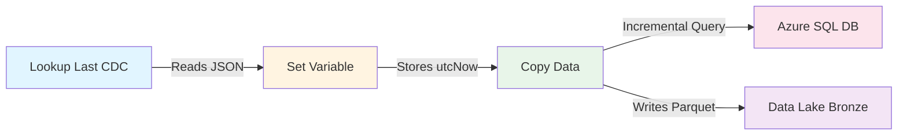

# Azure Data Engineering Project - Setup Guide

> Step-by-step guide to set up Azure resources for a data engineering project.

---

## Prerequisites

- Azure CLI installed (`az --version` to verify)
- Azure account (Free tier or Student subscription works)
- Terminal/Bash shell

---

## Step 0: Load Environment Variables

**IMPORTANT:** Before running any commands, load your environment variables from `.env` file.

### For Bash/Zsh users

```bash
# Load environment variables from .env file
# Run this at the start of EVERY terminal session
set -a  # automatically export all variables
source .env
set +a  # disable auto-export

# Verify variables are loaded
echo "Resource Group: $AZURE_RESOURCE_GROUP"
echo "Storage Account: $AZURE_STORAGE_ACCOUNT_NAME"
echo "SQL Server: $AZURE_SQL_SERVER_NAME"
```

### For Fish shell users

Fish shell doesn't support bash `.env` syntax. Use this helper function:

```bash
# Option 1: One-liner to load .env (run each time)
for line in (cat .env | grep -v '^#' | grep '=')
    set -gx (echo $line | cut -d '=' -f1) (echo $line | cut -d '=' -f2- | tr -d '"')
end

# Verify variables are loaded
echo "Resource Group: $AZURE_RESOURCE_GROUP"
echo "Storage Account: $AZURE_STORAGE_ACCOUNT_NAME"
echo "SQL Server: $AZURE_SQL_SERVER_NAME"
```

```bash
# Option 2: Add this function to ~/.config/fish/config.fish for permanent use
function loadenv
    for line in (cat .env | grep -v '^#' | grep '=')
        set -gx (echo $line | cut -d '=' -f1) (echo $line | cut -d '=' -f2- | tr -d '"')
    end
    echo "Loaded .env variables"
end

# Then just run: loadenv
```

```fish
# Option 3: Use bass plugin (if installed) to run bash commands
# Install: fisher install edc/bass
bass source .env
```

> **Note:** The `-gx` flag in fish means global and exported (available to subprocesses).

---

## Step 1: Login to Azure CLI

```bash
# Login to Azure (opens browser for authentication)
az login
```

**What happens:**

- Opens your default browser
- You authenticate with your Microsoft/Azure account
- CLI stores credentials locally (~/.azure/)

```bash
# Verify you're logged in and see your subscriptions
az account show --output table

# If you have multiple subscriptions, set the one you want to use
# az account set --subscription "Your Subscription Name"
```

---

## Step 2: Create a Resource Group

**What is a Resource Group?**
A logical container that holds related Azure resources. Think of it as a folder for your project.

```bash
# Create Resource Group using environment variables
az group create \
    --name "$AZURE_RESOURCE_GROUP" \
    --location "$AZURE_LOCATION"
```

**Expected output:**

```json
{
  "id": "/subscriptions/.../resourceGroups/azure-4-data-engineering-rg",
  "location": "eastus",
  "name": "azure-4-data-engineering-rg",
  "properties": {
    "provisioningState": "Succeeded"
  }
}
```

```bash
# Verify creation
az group show --name "$AZURE_RESOURCE_GROUP" --output table
```

---

## Step 3: Create a Storage Account

**What is a Storage Account?**
Central storage for all data types - blobs, files, queues, tables. This will be our Data Lake.

```bash
# Create Storage Account with Data Lake Gen2 enabled (--hns true)
az storage account create \
    --name "$AZURE_STORAGE_ACCOUNT_NAME" \
    --resource-group "$AZURE_RESOURCE_GROUP" \
    --location "$AZURE_LOCATION" \
    --sku "Standard_LRS" \
    --kind "StorageV2" \
    --hns true \
    --access-tier "Hot" \
    --allow-blob-public-access false \
    --min-tls-version "TLS1_2"
```

**Flag explanations:**

| Flag | Value | Purpose |
| ------ | ------- | --------- |
| `--sku` | Standard_LRS | Locally redundant storage (cheapest) |
| `--kind` | StorageV2 | General-purpose v2 (recommended) |
| `--hns` | true | Hierarchical namespace = Data Lake Gen2 |
| `--access-tier` | Hot | Frequently accessed data |
| `--allow-blob-public-access` | false | Security: no anonymous access |
| `--min-tls-version` | TLS1_2 | Security: enforce TLS 1.2 |

```bash
# Verify creation
az storage account show \
    --name "$AZURE_STORAGE_ACCOUNT_NAME" \
    --resource-group "$AZURE_RESOURCE_GROUP" \
    --output table
```

### Get Storage Account Key (for later use)

```bash
# Get the storage account key and save to .env
STORAGE_KEY=$(az storage account keys list \
    --account-name "$AZURE_STORAGE_ACCOUNT_NAME" \
    --resource-group "$AZURE_RESOURCE_GROUP" \
    --query "[0].value" -o tsv)

echo "Storage Key: $STORAGE_KEY"
echo "Add this to your .env file as AZURE_STORAGE_ACCOUNT_KEY"
```

for fish shell users:

```bash
set STORAGE_KEY (az storage account keys list \
    --account-name "$AZURE_STORAGE_ACCOUNT_NAME" \
    --resource-group "$AZURE_RESOURCE_GROUP" \
    --query "[0].value" -o tsv)
echo "Storage Key: $STORAGE_KEY"
echo "Add this to your .env file as AZURE_STORAGE_ACCOUNT_KEY"
```

---

## Step 4: Create a Data Factory

**What is Data Factory?**
Azure's ETL/ELT orchestration service. It moves and transforms data between sources.

```bash
# Create Data Factory
az datafactory create \
    --name "$AZURE_DATA_FACTORY_NAME" \
    --resource-group "$AZURE_RESOURCE_GROUP" \
    --location "$AZURE_LOCATION"
```

> **Note:** Data Factory creation takes 1-2 minutes.

```bash
# Verify creation
az datafactory show \
    --name "$AZURE_DATA_FACTORY_NAME" \
    --resource-group "$AZURE_RESOURCE_GROUP" \
    --output table
```

**Access Data Factory Studio:**

```url
https://adf.azure.com/home?factory=/subscriptions/<sub-id>/resourceGroups/<rg>/providers/Microsoft.DataFactory/factories/<adf-name>
```

Or simply search "Data Factory" in Azure Portal and click on your factory.

---

## Step 5: Create Storage Containers (Medallion Architecture)

**Medallion Architecture:**

- `landing` - Raw data arrives here first
- `bronze` - Raw data copy (unchanged from source)
- `silver` - Cleaned and validated data
- `gold` - Business-ready aggregations

```bash
# Create all containers for medallion architecture
for container in landing bronze silver gold; do
    echo "Creating container: $container"
    az storage container create \
        --name "$container" \
        --account-name "$AZURE_STORAGE_ACCOUNT_NAME" \
        --auth-mode login
done
```

> **Note:** If `--auth-mode login` gives permission errors, use `--auth-mode key` instead.
> The key method is simpler for learning but less secure for production.

```bash
# Alternative: Use key authentication (if login mode fails)
az storage container create \
    --name "landing" \
    --account-name "$AZURE_STORAGE_ACCOUNT_NAME" \
    --account-key "$AZURE_STORAGE_ACCOUNT_KEY"
```

```bash
# Verify containers were created
az storage container list \
    --account-name "$AZURE_STORAGE_ACCOUNT_NAME" \
    --auth-mode login \
    --output table
```

It should list:

```bash
Name     Lease Status    Last Modified
-------  --------------  -------------------------
bronze                   2026-02-01T05:03:01+00:00
gold                     2026-02-01T05:06:47+00:00
landing                  2026-02-01T05:06:56+00:00
silver                   2026-02-01T05:05:37+00:00
```

---

## Step 6: Upload Sample Data

```bash
# Upload sample data to the landing container
az storage blob upload \
    --account-name "$AZURE_STORAGE_ACCOUNT_NAME" \
    --container-name "landing" \
    --name "data/customers.csv" \
    --file "data/customers.csv" \
    --auth-mode key \
    --overwrite
```

> **Note:** `--overwrite` allows re-uploading without errors (like S3 behavior).

```bash
# Verify upload
az storage blob list \
    --account-name "$AZURE_STORAGE_ACCOUNT_NAME" \
    --container-name "landing" \
    --auth-mode key \
    --output table
```

### Upload Multiple Files

```bash
# Upload all CSV files from data directory
az storage blob upload-batch \
    --account-name "$AZURE_STORAGE_ACCOUNT_NAME" \
    --destination "landing" \
    --source "./data" \
    --pattern "*.csv" \
    --auth-mode key \
    --overwrite
```

---

## Step 7: Create Azure SQL Database

**Architecture:**

```architecture
SQL Server (logical server) → contains → SQL Database
          ↓
    Firewall Rules (who can connect)
```

### 7.1 Create SQL Server

```bash
# Create SQL Server (logical server)
# Using environment variables for credentials (secure!)
az sql server create \
    --name "$AZURE_SQL_SERVER_NAME" \
    --resource-group "$AZURE_RESOURCE_GROUP" \
    --location "$AZURE_LOCATION_SQL" \
    --admin-user "$AZURE_SQL_DATABASE_USER" \
    --admin-password "$AZURE_SQL_DATABASE_PASSWORD"
```

> **Note:** We use `westus2` for SQL because Student subscriptions have region limitations.
> The server name becomes: `sql-server-4-data-engineering.database.windows.net`

```bash
# Verify SQL Server creation
az sql server show \
    --name "$AZURE_SQL_SERVER_NAME" \
    --resource-group "$AZURE_RESOURCE_GROUP" \
    --output table
```

### 7.2 Create SQL Database

```bash
# Create SQL Database (Basic tier = $5/month, good for learning)
az sql db create \
    --name "$AZURE_SQL_DATABASE_NAME" \
    --server "$AZURE_SQL_SERVER_NAME" \
    --resource-group "$AZURE_RESOURCE_GROUP" \
    --edition "Basic" \
    --capacity 5
```

**Pricing tiers:**

| Tier | DTU | Storage | Cost/Month | Use Case |
| ------ | ----- | --------- | ------------ | ---------- |
| Basic | 5 | 2 GB | ~$5 | Learning, dev |
| Standard S0 | 10 | 250 GB | ~$15 | Small apps |
| Standard S1 | 20 | 250 GB | ~$30 | Production |

```bash
# Verify database creation
az sql db show \
    --name "$AZURE_SQL_DATABASE_NAME" \
    --server "$AZURE_SQL_SERVER_NAME" \
    --resource-group "$AZURE_RESOURCE_GROUP" \
    --output table
```

### 7.3 Configure Firewall Rules

**IMPORTANT:** By default, SQL Server blocks ALL connections. You must configure firewall rules.

```bash
# Rule 1: Allow Azure services (required for Data Factory, Databricks, etc.)
az sql server firewall-rule create \
    --name "AllowAzureServices" \
    --server "$AZURE_SQL_SERVER_NAME" \
    --resource-group "$AZURE_RESOURCE_GROUP" \
    --start-ip-address 0.0.0.0 \
    --end-ip-address 0.0.0.0
```

> **Note:** `0.0.0.0` to `0.0.0.0` is a special range that means "Allow Azure services"

```bash
# Rule 2: Allow your current IP address (for local development)
MY_IP=$(curl -s ifconfig.me)
echo "Your IP: $MY_IP"

az sql server firewall-rule create \
    --name "AllowMyIP" \
    --server "$AZURE_SQL_SERVER_NAME" \
    --resource-group "$AZURE_RESOURCE_GROUP" \
    --start-ip-address "$MY_IP" \
    --end-ip-address "$MY_IP"
```

```bash
# Verify firewall rules
az sql server firewall-rule list \
    --server "$AZURE_SQL_SERVER_NAME" \
    --resource-group "$AZURE_RESOURCE_GROUP" \
    --output table
```

### 7.4 Test SQL Connection

```bash
# Test connection using sqlcmd (if installed)
# sqlcmd -S "$AZURE_SQL_SERVER_NAME.database.windows.net" \
#        -d "$AZURE_SQL_DATABASE_NAME" \
#        -U "$AZURE_SQL_DATABASE_USER" \
#        -P "$AZURE_SQL_DATABASE_PASSWORD"

# Or use Azure Portal → SQL Database → Query Editor
echo "Connection string for your apps:"
echo "$AZURE_SQL_CONNECTION_STRING"
```

---

## Step 8: Verify All Resources

```bash
# List all resources in the resource group
az resource list \
    --resource-group "$AZURE_RESOURCE_GROUP" \
    --output table
```

**Expected resources:**

| Name | Type |
| ------ | ------ |
| sa4dataengineering4rk | Storage Account |
| adf-4-data-engineering-rk | Data Factory |
| sql-server-4-data-engineering | SQL Server |
| sqldb-4-data-engineering | SQL Database |

---

## Cleanup (Optional)

**WARNING:** This deletes EVERYTHING in the resource group!

```bash
# Delete all resources (use with caution!)
# az group delete --name "$AZURE_RESOURCE_GROUP" --yes --no-wait
```

---

## Quick Reference - All Commands

```bash
# Load env vars (run first!)
set -a && source .env && set +a

# Login
az login

# Create resource group
az group create --name "$AZURE_RESOURCE_GROUP" --location "$AZURE_LOCATION"

# Create storage account
az storage account create --name "$AZURE_STORAGE_ACCOUNT_NAME" --resource-group "$AZURE_RESOURCE_GROUP" --location "$AZURE_LOCATION" --sku "Standard_LRS" --kind "StorageV2" --hns true

# Create containers
for c in landing bronze silver gold; do az storage container create --name "$c" --account-name "$AZURE_STORAGE_ACCOUNT_NAME" --auth-mode login; done

# Create data factory
az datafactory create --name "$AZURE_DATA_FACTORY_NAME" --resource-group "$AZURE_RESOURCE_GROUP" --location "$AZURE_LOCATION"

# Create SQL server & database
az sql server create --name "$AZURE_SQL_SERVER_NAME" --resource-group "$AZURE_RESOURCE_GROUP" --location "$AZURE_LOCATION_SQL" --admin-user "$AZURE_SQL_DATABASE_USER" --admin-password "$AZURE_SQL_DATABASE_PASSWORD"
az sql db create --name "$AZURE_SQL_DATABASE_NAME" --server "$AZURE_SQL_SERVER_NAME" --resource-group "$AZURE_RESOURCE_GROUP" --edition "Basic"

# Configure firewall
az sql server firewall-rule create --name "AllowAzureServices" --server "$AZURE_SQL_SERVER_NAME" --resource-group "$AZURE_RESOURCE_GROUP" --start-ip-address 0.0.0.0 --end-ip-address 0.0.0.0
```

---

## Troubleshooting

### "AuthorizationFailed" error

```bash
# Check your current subscription
az account show

# List available subscriptions
az account list --output table

# Switch subscription
az account set --subscription "Your Subscription Name"
```

### "Storage account name already taken"

Storage account names must be globally unique. Add random characters:

```bash
AZURE_STORAGE_ACCOUNT_NAME="sa4dataeng$(date +%s | tail -c 5)"
```

### "SQL Server firewall blocking connection"

```bash
# Add your current IP
MY_IP=$(curl -s ifconfig.me)
az sql server firewall-rule create \
    --name "AllowMyIP_$(date +%Y%m%d)" \
    --server "$AZURE_SQL_SERVER_NAME" \
    --resource-group "$AZURE_RESOURCE_GROUP" \
    --start-ip-address "$MY_IP" \
    --end-ip-address "$MY_IP"
```

### "Environment variable not set"

```bash
# Verify .env is loaded
echo $AZURE_RESOURCE_GROUP

# If empty, reload
set -a && source .env && set +a
```

## Adding Data to Azure SQL Database

You can run SQL scripts against your Azure SQL Database using several methods:

### Option 1: VS Code with MS SQL Extension (Recommended)

1. **Install the extension**: Search for "SQL Server (mssql)" in VS Code extensions

2. **Connect to your database**:
   - Open Command Palette: `Cmd + Shift + P` (Mac) or `Ctrl + Shift + P` (Windows)
   - Type: `MS SQL: Connect`
   - Enter connection details:

     ```text
     Server:   sql-server-4-data-engineering.database.windows.net
     Database: sqldb-4-data-engineering
     Auth:     SQL Login
     User:     (from your .env file)
     Password: (from your .env file)
     ```

   - Save the connection profile when prompted (e.g., "AzureSpotifyDB")

3. **Run your SQL script**:
   - Open `sql/spotify_initial_load.sql`
   - `Cmd + Shift + P` → `MS SQL: Execute Query`
   - Select your saved connection
   - **Quick tip**: Right-click in the SQL file and select "Execute Query"

### Option 2: Azure Portal Query Editor

```text
Azure Portal → SQL Database → Query Editor → Login → Paste & Run
```

### Option 3: sqlcmd CLI

```bash
# Install sqlcmd (Mac)
brew install sqlcmd

# Run a SQL script
sqlcmd -S "$AZURE_SQL_SERVER_NAME.database.windows.net" \
       -d "$AZURE_SQL_DATABASE_NAME" \
       -U "$AZURE_SQL_DATABASE_USER" \
       -P "$AZURE_SQL_DATABASE_PASSWORD" \
       -i sql/spotify_initial_load.sql
```

### Option 4: Azure Data Studio

```bash
# Install on Mac
brew install --cask azure-data-studio
```

Then connect using the same credentials as Option 1.

---

## Step 8: Create Linked Services in Data Factory

Linked services are connection strings that allow Data Factory to connect to external data sources.

### 8.1 Create a Linked Service to Azure SQL Database

**Via Data Factory Studio (UI):**

1. **Open Data Factory Studio**:
   - Go to Azure Portal → Data Factory → Click "Launch Studio"

2. **Navigate to Linked Services**:
   - Click the "Manage" tab (gear icon on the left sidebar)
   - Select "Linked services" under "Connections"
   - Click "+ New"

3. **Select Azure SQL Database**:
   - Search for "Azure SQL Database"
   - Click "Continue"

4. **Configure the connection**:
   - **Name**: `AzureSqlDb_LinkedService`
   - **Server name**: `sql-server-4-data-engineering.database.windows.net`
   - **Database name**: `sqldb-4-data-engineering`
   - **Authentication type**: SQL authentication
   - **User name**: (from your .env file)
   - **Password**: (from your .env file)
   - Click "Test connection" to verify
   - Click "Create"

**Via Azure CLI:**

```bash
# Create a JSON definition file for the linked service
cat > /tmp/sql-linked-service.json << 'EOF'
{
    "type": "AzureSqlDatabase",
    "typeProperties": {
        "connectionString": "Server=tcp:sql-server-4-data-engineering.database.windows.net,1433;Database=sqldb-4-data-engineering;User ID=real_mfalme;Password=YOUR_PASSWORD;Encrypt=True;Connection Timeout=30"
    }
}
EOF

# Create the linked service
az datafactory linked-service create \
    --factory-name "$AZURE_DATA_FACTORY_NAME" \
    --resource-group "$AZURE_RESOURCE_GROUP" \
    --name "AzureSqlDb_LinkedService" \
    --properties @/tmp/sql-linked-service.json
```

> **Note:** Replace `YOUR_PASSWORD` with your actual password or use Key Vault for production.

### 8.2 Create a Linked Service to Azure Data Lake Storage Gen2

**Via Data Factory Studio (UI):**

1. **Navigate to Linked Services**:
   - Click the "Manage" tab → "Linked services" → "+ New"

2. **Select Azure Data Lake Storage Gen2**:
   - Search for "Azure Data Lake Storage Gen2"
   - Click "Continue"

3. **Configure the connection**:
   - **Name**: `AzureDataLake_LinkedService`
   - **Authentication method**: Account key
   - **Account selection method**: From Azure subscription
   - **Storage account name**: `sa4dataengineering4rk`
   - Click "Test connection" to verify
   - Click "Create"

**Via Azure CLI:**

```bash
# Create a JSON definition file for the storage linked service
cat > /tmp/storage-linked-service.json << 'EOF'
{
    "type": "AzureBlobFS",
    "typeProperties": {
        "url": "https://sa4dataengineering4rk.dfs.core.windows.net",
        "accountKey": {
            "type": "SecureString",
            "value": "YOUR_STORAGE_ACCOUNT_KEY"
        }
    }
}
EOF

# Create the linked service
az datafactory linked-service create \
    --factory-name "$AZURE_DATA_FACTORY_NAME" \
    --resource-group "$AZURE_RESOURCE_GROUP" \
    --name "AzureDataLake_LinkedService" \
    --properties @/tmp/storage-linked-service.json
```

> **Note:** Replace `YOUR_STORAGE_ACCOUNT_KEY` with your actual key from `.env` or use Managed Identity for production.

### Verify Linked Services

```bash
# List all linked services in your Data Factory
az datafactory linked-service list \
    --factory-name "$AZURE_DATA_FACTORY_NAME" \
    --resource-group "$AZURE_RESOURCE_GROUP" \
    --output table
```

## Step 9: Create Incremental Ingestion Pipeline (Change Data Capture)

### Overview

This pipeline implements **Change Data Capture (CDC)** to incrementally load only new or modified records from Azure SQL Database to Azure Data Lake Storage. Instead of loading the entire table each time, we track the last processed timestamp and only load records created/modified after that time.

**Pipeline Flow:**

```pipeline_flow
┌─────────────────┐      ┌──────────────────┐      ┌─────────────────┐
│  Lookup Last    │ ───> │  Set Variable    │ ───> │   Copy Data     │
│  CDC Timestamp  │      │  (current_time)  │      │ (Incremental)   │
└─────────────────┘      └──────────────────┘      └─────────────────┘
        │                                                    │
        │ Read from:                                        │ Write to:
        │ bronze/change_data_capture/                       │ bronze/dim_user/
        │ change_data_capture.json                          │ dim_user_2026-02-01.parquet
        │                                                    │
        │ Contains: {"cdc_value": "2026-01-01"}            │ SQL Query filters:
        │                                                    │ WHERE updated_at > '2026-01-01'
```

**How it works:**

1. **Lookup** reads the last processed timestamp from a JSON file
2. **Set Variable** captures the current timestamp for later updates
3. **Copy Data** queries SQL database for records newer than last timestamp
4. After successful run, update the JSON file with the new timestamp (manual or via another activity)

---

### Step 9.1: Prepare the CDC Tracking File

First, create a JSON file to track the last CDC timestamp.

inside `change_data_capture` add a file named `change_data_capture.json` with the following content:

```json
{
    "cdc_value": "1900-01-01"
}
```

```bash
# Upload to Azure (directory will be created automatically with the file path)
az storage blob upload \
    --account-name "$AZURE_STORAGE_ACCOUNT_NAME" \
    --container-name "bronze" \
    --name "change_data_capture/change_data_capture.json" \
    --file change_data_capture/change_data_capture.json \
    --auth-mode key \
    --overwrite
```

> **Note:**
>
> - `"1900-01-01"` ensures the first run captures all historical data
> - The `change_data_capture/` directory is created automatically when uploading the file
> - Azure Data Lake Gen2 (hierarchical namespace) creates directories implicitly

---

### Step 9.2: Create Pipeline Parameters

1. **Open Data Factory Studio** → **Author** tab → **Pipelines** → **+ New Pipeline**
2. **Name**: `incremental_ingestion_pipeline`
3. **Add Pipeline Parameters** (click on canvas background to see properties):

| Parameter Name | Type | Default Value | Description |
| ---------------- | ------ | --------------- | ------------- |
| `schema` | String | `dbo` | SQL schema name |
| `table` | String | `dim_user` | SQL table name |
| `change_data_capture_column` | String | `updated_at` | Column to track changes |

**How to add parameters:**

- Click on empty canvas (not an activity)
- Click **Parameters** tab in the bottom panel
- Click **+ New** for each parameter above

---

### Step 9.3: Create Pipeline Variable

Variables store temporary values during pipeline execution.

1. **Click on canvas background** → **Variables** tab
2. **Add Variable**:
   - **Name**: `current_time_value`
   - **Type**: String
   - **Default value**: (leave empty)

---

### Step 9.4: Add Lookup Activity

The Lookup activity reads the last CDC timestamp from the JSON file.

#### A. Add the Activity

1. In the **Activities** toolbar, expand **General**
2. Drag **Lookup** onto the canvas
3. **Name**: `look_up_last_cdc_value`

#### B. Create JSON Dataset (Dynamic)

1. In the **Settings** tab of Lookup activity → **Source dataset** → **+ New**
2. Select **Azure Data Lake Storage Gen2** → **Continue**
3. Select format: **JSON** → **Continue**
4. Configure dataset:
   - **Name**: `azure_data_lake_storage_json_dynamic`
   - **Linked service**: `azure_data_lake_4_data_engineering`
   - Click **OK**

5. **Open the dataset for parameterization**:
   - Click the link: `Open this dataset for more advanced configuration with parameterization`
   - Go to **Parameters** tab
   - Add three parameters:

   | Parameter | Type | Default Value |
   | ----------- | ------ | --------------- |
   | `container` | String | (empty) |
   | `folder` | String | (empty) |
   | `file` | String | (empty) |

6. **Configure File Path** (in **Connection** tab):
   - Click in the **File path** boxes and use **Add dynamic content**:

   ```file_path
   Container: @dataset().container
   Directory: @dataset().folder  
   File:      @dataset().file
   ```

7. **Save** and go back to the pipeline

#### C. Configure Lookup Activity Parameters

Back in the Lookup activity's **Settings** tab:

- **Source dataset**: `azure_data_lake_storage_json_dynamic`
- **Dataset parameters**:
  - `container`: `bronze`
  - `folder`: `change_data_capture`
  - `file`: `change_data_capture.json`
- **First row only**: ✓ (checked)

---

### Step 9.5: Add Set Variable Activity

This captures the current timestamp for naming the output file.

1. Drag **Set Variable** activity onto canvas
2. **Name**: `set_current_time_value`
3. Connect **Lookup** → **Set Variable** (drag the green arrow)
4. In **Settings** tab:
   - **Variable name**: `current_time_value`
   - **Value**: Click **Add dynamic content** and enter:

   ```
   @utcNow()
   ```

---

### Step 9.6: Add Copy Data Activity

This reads incremental data from SQL and writes to Data Lake.

#### A. Add the Activity

1. Drag **Copy Data** activity onto canvas
2. **Name**: `incremental_ingestion_copy_data`
3. Connect **Set Variable** → **Copy Data** (drag the green arrow)

> **IMPORTANT**: The order must be: Lookup → Set Variable → Copy Data

#### B. Configure Source (SQL Database)

1. **Source** tab → **Source dataset** → **+ New**
2. Select **Azure SQL Database** → **Continue**
3. Configure dataset:
   - **Name**: `azure_sql_data_source_pipeline`
   - **Linked service**: `azure_db_4_data_engineering`
   - Click **OK**

4. **Back in Source tab**:
   - **Use query**: **Query**
   - **Query**: Click **Add dynamic content** and enter:

   ```sql
   SELECT * 
   FROM @{pipeline().parameters.schema}.@{pipeline().parameters.table} 
   WHERE @{pipeline().parameters.change_data_capture_column} > '@{activity('look_up_last_cdc_value').output.firstRow.cdc_value}'
   ```

   > **Explanation**:
   > - `@{pipeline().parameters.schema}` → `dbo`
   > - `@{pipeline().parameters.table}` → `dim_user`
   > - `@{pipeline().parameters.change_data_capture_column}` → `updated_at`
   > - `@{activity('look_up_last_cdc_value').output.firstRow.cdc_value}` → Value from JSON file

#### C. Create Parquet Dataset (Dynamic)

1. **Sink** tab → **Sink dataset** → **+ New**
2. Select **Azure Data Lake Storage Gen2** → **Continue**
3. Select format: **Parquet** → **Continue**
4. Configure dataset:
   - **Name**: `azure_data_lake_storage_parquet_dynamic`
   - **Linked service**: `azure_data_lake_4_data_engineering`
   - Click **OK**

5. **Open the dataset for parameterization**:
   - Go to **Parameters** tab
   - Add three parameters:

   | Parameter | Type | Default Value |
   |-----------|------|---------------|
   | `container` | String | (empty) |
   | `folder` | String | (empty) |
   | `file` | String | (empty) |

6. **Configure File Path** (in **Connection** tab):

   ```
   Container: @dataset().container
   Directory: @dataset().folder
   File:      @concat(dataset().file, '.parquet')
   ```

7. **Save** and go back to the pipeline

#### D. Configure Sink Parameters

Back in the Copy Data **Sink** tab:

- **Sink dataset**: `azure_data_lake_storage_parquet_dynamic`
- **Dataset parameters**:
  - `container`: `bronze`
  - `folder`: `dim_user`
  - `file`: Click **Add dynamic content**:
  
  ```
  @concat(pipeline().parameters.table, '_', variables('current_time_value'))
  ```

  This creates files like: `dim_user_2026-02-01T14:30:00Z.parquet`

---

### Step 9.7: Validate and Debug

#### Validate Pipeline

1. Click **Validate** button in toolbar
2. Check for errors in the **Output** panel
3. Common issues:
   - Activities not connected in correct order
   - Missing parameters
   - Incorrect dynamic expressions

#### Debug Pipeline

1. Click **Debug** button
2. Enter parameter values:
   - `schema`: `dbo`
   - `table`: `dim_user`
   - `change_data_capture_column`: `updated_at` (or your timestamp column)
3. Click **OK**

**Expected flow:**

```
✓ look_up_last_cdc_value   → Reads: {"cdc_value": "1900-01-01"}
✓ set_current_time_value    → Sets: "2026-02-01T14:30:00Z"
✓ incremental_ingestion_... → Copies records where updated_at > '1900-01-01'
```

---

### Step 9.8: Troubleshooting Common Errors

#### Error: "BadRequest" with no message

**Likely causes:**

1. **Activity dependency order is wrong**
   - ❌ Copy Data → Lookup (wrong!)
   - ✓ Lookup → Set Variable → Copy Data (correct!)

2. **JSON field name mismatch**
   - JSON file has: `"change_data_capture_column"`
   - Expression uses: `"cdc_value"`
   - **Fix**: Use consistent names. Recommended: `"cdc_value"`

3. **Variable used before being set**
   - Copy Data references `variables('current_time_value')` but Set Variable hasn't run yet
   - **Fix**: Ensure Set Variable runs before Copy Data

#### Error: "The expression 'activity('look_up_last_cdc_value')' cannot be evaluated"

**Cause**: Copy Data is trying to execute before Lookup completes.

**Fix**: Check the green arrows (dependencies). Should be:

```
Lookup → Set Variable → Copy Data
```

#### Error: Column does not exist or Invalid object name

**Cause**: The table name or column name doesn't match your actual SQL schema.

**Fix**:

1. Check your table schema (e.g., `dbo.dim_user` not `Users`)
2. Update the `table` parameter to match exactly (case-sensitive)
3. Update the `change_data_capture_column` parameter to match your actual timestamp column (e.g., `updated_at`, `ModifiedDate`, `LastUpdated`)

---

### Step 9.9: Update CDC Value After Pipeline Run

After a successful pipeline run, you need to update the CDC tracking file with the new timestamp.

**Manual update via Azure Portal:**

1. Go to **Storage Account** → **Containers** → **bronze** → **change_data_capture**
2. Click on `change_data_capture.json`
3. Click **Edit**
4. Update to:

```json
{
    "cdc_value": "2026-02-01T14:30:00Z"
}
```

**Automated update (Advanced):**

Add a **Copy Data** activity at the end to write the new timestamp:

- Source: Empty dataset
- Sink: Same JSON file
- Use **Additional columns** to write: `@variables('current_time_value')`

---

### Pipeline Summary



**What you've built:**

- ✅ Reusable pipeline with parameters
- ✅ Incremental data loading (not full refresh)
- ✅ Dynamic file naming with timestamps
- ✅ Tracked CDC state in JSON file
- ✅ Efficient: Only processes new/changed records

**Next steps:**

- Add error handling (If Condition, Try-Catch)
- Automate CDC value updates
- Schedule pipeline with triggers
- Add logging and monitoring
